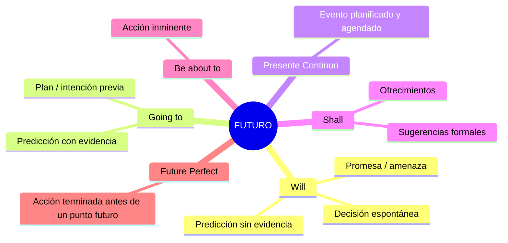
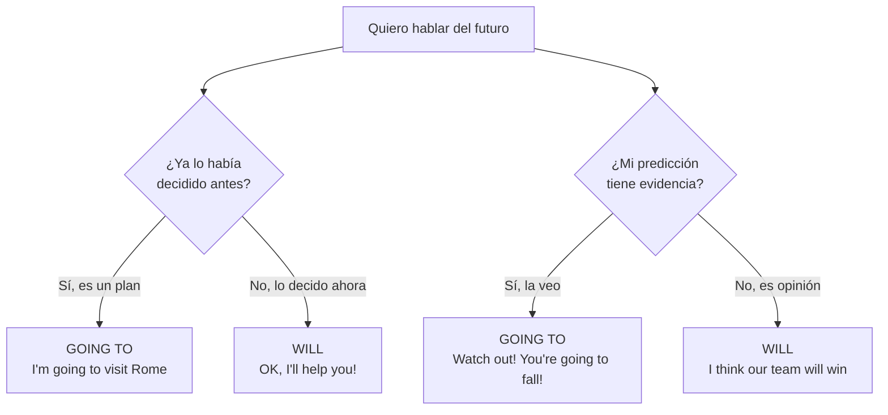

# B1 · Gramática 01 — El Futuro en Inglés

> 🎯 **Objetivo de la unidad:** dominar las **seis** formas de expresar futuro en inglés y saber *cuál* elegir según la intención (predicción, plan, promesa, decisión espontánea o evento inminente).

El error más común de los hispanohablantes es traducir todo futuro como *will*, porque en español tenemos una sola conjugación ("hablaré"). En inglés, la elección de la forma **comunica tu intención**. Esta unidad te enseña a escogerla bien.

## Mapa conceptual del futuro

---

## 1.1 Futuro con "Will"

Se usa *will* /wɪl/ para:

- ✔️ **Predicciones** sin evidencia concreta (una corazonada, una opinión).
- ✔️ **Decisiones espontáneas** tomadas en el momento de hablar.
- ✔️ **Promesas, ofrecimientos y amenazas.**

📌 **Estructura:**

| Forma | Fórmula | Ejemplo |
|---|---|---|
| Afirmativa | Sujeto + will + verbo base | *I will call you later.* |
| Negativa | Sujeto + won't + verbo base | *She won't come.* |
| Interrogativa | Will + sujeto + verbo base? | *Will they help us?* |

📌 **Ejemplos:**
> *I will call you later.* (Te llamaré más tarde.) — promesa
> *She will be a great doctor.* (Será una gran doctora.) — predicción
> *I think it will snow tonight.* /snoʊ/ (Creo que nevará esta noche.) — opinión

🔸 **Ampliación — contracciones:** en el habla real casi siempre se contrae: *I'll, you'll, he'll, she'll, we'll, they'll*. La negativa es *won't* /woʊnt/ (¡ojo!, no "willn't").

---

## 1.2 Futuro con "Going to"

Se usa *going to* /ˈɡoʊɪŋ tu/ (coloquialmente *gonna* /ˈɡʌnə/) para:

- ✔️ **Planes e intenciones** decididos *antes* del momento de hablar.
- ✔️ **Predicciones basadas en evidencia** presente y visible.

📌 **Estructura:** Sujeto + am/is/are + going to + verbo base.

📌 **Ejemplos:**
> *I am going to study medicine.* (Voy a estudiar medicina.) — intención previa
> *Look at those clouds! It is going to rain.* (¡Mira esas nubes! Va a llover.) — evidencia
> *They are going to move to Spain.* (Se van a mudar a España.)

### 🔑 Will vs Going to — la diferencia que todos confunden

| Situación | Forma correcta | Por qué |
|---|---|---|
| El teléfono suena, decides contestar | *I'll get it!* | Decisión espontánea |
| Ya compraste boletos para Roma | *I'm going to visit Rome.* | Plan previo |
| Ves nubes negras | *It's going to rain.* | Evidencia visible |
| Crees que tu equipo ganará | *They will win.* | Opinión sin evidencia |

---

## 1.3 Presente Continuo con Sentido de Futuro

El presente continuo también expresa futuro cuando el evento está **planificado y agendado** (con fecha, hora o cita concreta). Es incluso más "seguro" que *going to*.

📌 **Estructura:** Sujeto + am/is/are + verbo-ing + (referencia temporal futura).

📌 **Ejemplos:**
> *We are traveling to London next week.* (Viajamos a Londres la próxima semana.)
> *She is meeting her boss tomorrow.* (Se reúne con su jefe mañana.)
> *I'm having dinner with Sarah on Friday.*

🔸 **Matiz clave:** *going to* = intención; **presente continuo** = arreglo ya hecho (reservas, citas). *"I'm flying to Paris at 6 PM"* suena a boleto ya comprado.

---

## 1.4 Futuro con "Shall"

*Shall* /ʃæl/ es formal (más común en inglés británico). Se usa con *I* y *we* para:

- ✔️ **Ofrecimientos:** *Shall I help you?* (¿Te ayudo?)
- ✔️ **Sugerencias:** *Shall we go to the beach?* (¿Vamos a la playa?)

🔸 **Ampliación:** en documentos legales, *shall* expresa obligación: *"The tenant shall pay rent monthly."* (El inquilino deberá pagar...).

---

## 1.5 Futuro con "Be About To"

Indica una acción **a punto de ocurrir** en segundos o minutos (futuro inminente).

📌 **Estructura:** Sujeto + am/is/are + about to + verbo base.

📌 **Ejemplos:**
> *The movie is about to start.* (La película está a punto de empezar.)
> *Be careful! The glass is about to fall.* /ɡlæs/ (¡Cuidado! El vaso está a punto de caerse.)

🔸 **Ampliación — "on the verge of":** registro más formal/dramático: *"The company is on the verge of bankruptcy."* /ˈbæŋkrʌptsi/ (al borde de la quiebra).

---

## 1.6 Future Perfect (ampliación B1→B2)

Aunque el libro lo trata en B2, conviene presentarlo: describe una acción que **estará terminada antes de un punto futuro**.

📌 **Estructura:** Sujeto + will have + participio pasado.

> *By 2030, I will have finished my degree.* (Para 2030, habré terminado mi carrera.)
> *She will have left by the time you arrive.* (Ella se habrá ido para cuando llegues.)

---

## 1.7 Expresiones de tiempo futuro

| Expresión | IPA | Significado |
|---|---|---|
| tomorrow | /təˈmɒroʊ/ | mañana |
| next week/month/year | — | la próxima semana/mes/año |
| in a few days | — | en unos días |
| soon | /sun/ | pronto |
| shortly | /ˈʃɔːrtli/ | en breve |
| in the near future | — | en un futuro cercano |

---

## ✅ Resumen visual

| Forma | Uso principal | Ejemplo modelo |
|---|---|---|
| **will** | predicción / decisión espontánea / promesa | *I'll help you.* |
| **going to** | plan previo / predicción con evidencia | *I'm going to travel.* |
| **presente continuo** | evento agendado | *I'm meeting her at 5.* |
| **shall** | ofrecimiento / sugerencia formal | *Shall we dance?* |
| **be about to** | acción inminente | *It's about to rain.* |
| **future perfect** | terminado antes de un punto futuro | *I'll have finished by then.* |

## 🏋️ Práctica

1. Elige will o going to: *"The phone is ringing. I ___ answer it."* / *"I've decided — I ___ study French."*
2. Reescribe con presente continuo: *"I have plans to see the dentist tomorrow."*
3. Traduce usando *be about to*: "El tren está a punto de salir."
4. Forma future perfect: "Para el viernes, ellos habrán vendido la casa."

Ver respuestas

1. *I'll answer it* (espontánea) / *I'm going to study French* (plan).
2. *I'm seeing the dentist tomorrow.*
3. *The train is about to leave.*
4. *By Friday, they will have sold the house.*

