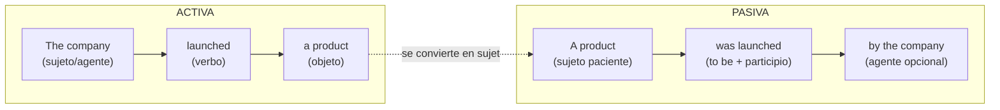
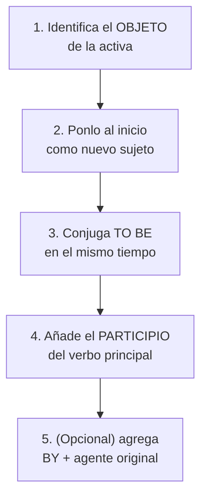

# B1 · Gramática 02 — Voz Pasiva (Introducción)

> 🎯 **Objetivo:** entender *por qué* y *cuándo* el inglés prefiere la voz pasiva, y aprender a transformar cualquier oración activa en pasiva sin equivocarte de tiempo verbal.

En español usamos mucho el "se" impersonal ("se construyó el puente"). El inglés resuelve eso con la **voz pasiva**, muy frecuente en noticias, ciencia, informes y contextos formales. Dominarla es un salto grande de naturalidad.

## ¿Qué cambia entre activa y pasiva?

El **objeto** de la activa se vuelve el **sujeto** de la pasiva. El foco pasa de *quién hace* a *qué recibe* la acción.

---

## 2.1 Formación de la Voz Pasiva

📌 **Fórmula maestra:**
> **Objeto** + verbo *to be* (en el tiempo correspondiente) + **participio pasado** + (*by* + agente, opcional).

📌 **Ejemplo base:**
> Activa: *The company launched a new product.*
> Pasiva: *A new product **was launched** by the company.*

🔑 **La clave que casi nadie explica bien:** el tiempo verbal de la oración vive en el verbo *to be*, **no** en el participio. El participio nunca cambia.

---

## 2.2 Cuándo Usar la Voz Pasiva

| Situación | Ejemplo |
|---|---|
| El agente es **desconocido** | *A valuable painting was stolen last night.* |
| Queremos **enfatizar la acción**, no quién la hizo | *The project was completed on time.* |
| Textos **formales/científicos** | *The vaccine* /vækˈsin/ *was developed in record time.* |
| Sonar **objetivo o impersonal** | *Mistakes were made during the process.* |

🔸 **Ampliación cultural:** *"Mistakes were made"* es una frase famosa en política precisamente porque la pasiva **oculta al responsable**. La pasiva es la gramática de la diplomacia.

---

## 2.3 Conversión paso a paso (Activa → Pasiva)

📌 **Ejemplo resuelto:**
> Activa: *They built the bridge in 2010.*
> - Objeto = *the bridge* → nuevo sujeto
> - *build* está en pasado → *to be* en pasado = *was*
> - participio de *build* = *built*
> - Pasiva: ***The bridge was built in 2010.***

---

## 2.4 La voz pasiva en cada tiempo verbal

| Tiempo | Activa | Pasiva |
|---|---|---|
| Presente simple | They **make** cars in Japan. | Cars **are made** in Japan. |
| Presente continuo | They **are building** a road. | A road **is being built.** |
| Pasado simple | They **painted** the house. | The house **was painted.** |
| Pasado continuo | They **were cleaning** it. | It **was being cleaned.** |
| Presente perfecto | They **have finished** it. | It **has been finished.** |
| Pasado perfecto | They **had sent** it. | It **had been sent.** |
| Futuro (will) | They **will announce** results. | Results **will be announced.** |
| Modal | They **must complete** it. | It **must be completed.** |

🔸 **Ampliación:** fíjate en el patrón de los continuos → *is/was **being** + participio*. Y los perfectos → *has/had **been** + participio*. Memoriza *being* y *been* como las dos piezas que delatan un continuo o un perfecto en pasiva.

---

## 2.5 Cuándo NO usar la voz pasiva

❌ **Verbos intransitivos** (sin objeto directo): no se puede pasivizar *sleep, arrive, die, happen*. No existe *"is slept"*.

❌ **Cuando el agente es lo importante:** si quieres destacar quién hizo algo, usa activa: *The president signed the law* (mejor que *The law was signed by the president*).

---

## ✅ Resumen

- Pasiva = **to be** (con el tiempo) + **participio pasado**.
- El objeto de la activa → sujeto de la pasiva.
- *being* aparece en continuos; *been* aparece en perfectos.
- Úsala cuando el agente sea desconocido, irrelevante o cuando quieras sonar formal.

## 🏋️ Práctica

Convierte a pasiva:
1. *Shakespeare wrote "Hamlet".*
2. *They are repairing the road.*
3. *Someone has eaten my sandwich.*
4. *The teacher will explain the lesson.*

Ver respuestas

1. *"Hamlet" was written by Shakespeare.*
2. *The road is being repaired.*
3. *My sandwich has been eaten.*
4. *The lesson will be explained by the teacher.*

