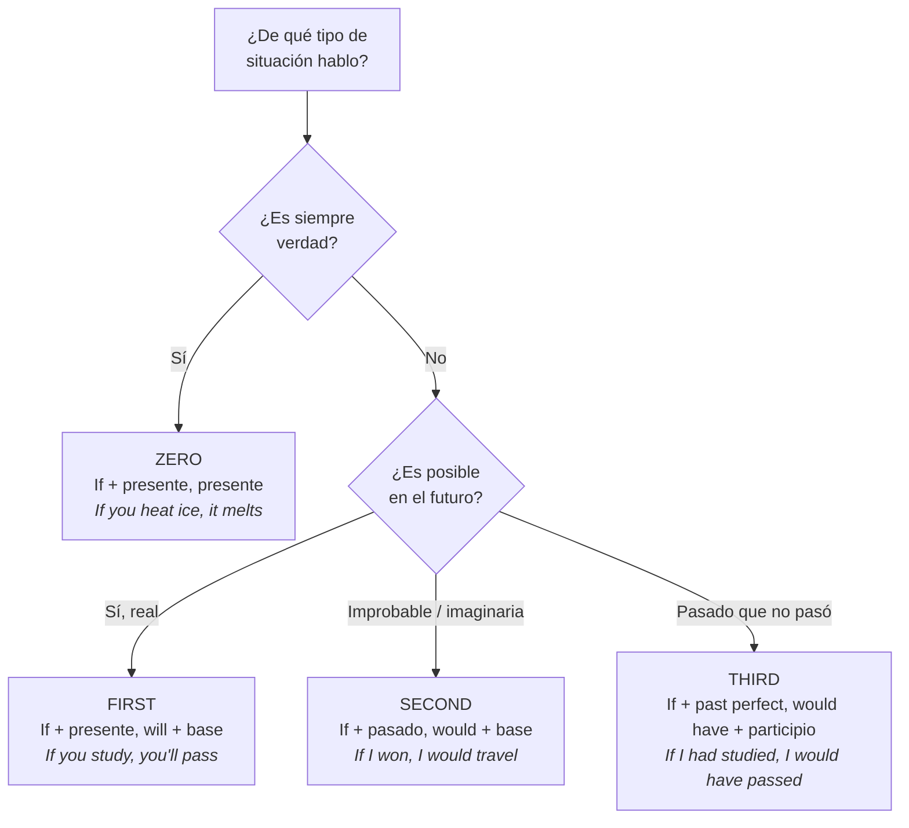

# B1 · Gramática 03 — Condicionales

> 🎯 **Objetivo:** hablar de posibilidades, hipótesis y arrepentimientos usando los cuatro condicionales, sabiendo exactamente qué tiempo verbal va en cada mitad de la oración.

Un condicional tiene dos partes: la **condición** (cláusula con *if*) y el **resultado**. La dificultad no es el concepto, sino **no mezclar los tiempos verbales**. Esta unidad te da una regla mecánica para cada tipo.

## Los 4 condicionales de un vistazo

---

## 3.1 Condicional Cero (Zero Conditional)

📌 **Uso:** verdades universales, hechos científicos, cosas que **siempre** ocurren.

📌 **Estructura:** `If + presente simple, presente simple.`

> *If you heat water to 100°C, it boils.* (Si calientas agua a 100°C, hierve.)
> *If you touch fire, you get burned.* (Si tocas fuego, te quemas.)

🔸 Puedes sustituir *if* por *when/whenever* sin cambiar el sentido: *When you heat ice, it melts.*

---

## 3.2 Condicional Tipo 1 (First Conditional)

📌 **Uso:** situaciones **reales y probables** en el futuro.

📌 **Estructura:** `If + presente simple, will + verbo base.`

> *If you study, you will pass the exam.*
> *If it rains tomorrow, we will stay home.*
> *If you don't hurry, you will miss the bus.*

🔸 **Ampliación:** puedes cambiar *will* por otros modales para matizar la probabilidad:
> *If you ask her, she **might** say yes.* (posibilidad)
> *If you're tired, you **should** rest.* (consejo)
> *If you finish early, you **can** leave.* (permiso)

---

## 3.3 Condicional Tipo 2 (Second Conditional)

📌 **Uso:** situaciones **hipotéticas, improbables o imaginarias** en el presente/futuro.

📌 **Estructura:** `If + pasado simple, would + verbo base.`

> *If I won the lottery, I would travel the world.*
> *If she had more money, she would buy a bigger house.*
> *If I were you, I would take that job.*

🔑 **Regla del subjuntivo *were*:** con el verbo *to be*, la forma correcta es **were** para todas las personas, no *was*:
> ✅ *If I **were** rich...* / ✅ *If he **were** here...*
> (En habla muy informal se oye *was*, pero *were* es el estándar culto.)

🔸 **"If I were you"** es la forma nativa de dar consejos — memorízala como bloque.

---

## 3.4 Condicional Tipo 3 (Third Conditional)

📌 **Uso:** situaciones **pasadas que NO ocurrieron** y sus consecuencias imaginarias. Es el condicional del **arrepentimiento**.

📌 **Estructura:** `If + past perfect, would have + participio pasado.`

> *If you had studied, you would have passed the exam.*
> *If I had left earlier, I wouldn't have missed the train.*
> *If she had told me, I would have helped her.*

🔸 **Ampliación:** cambia *would have* por *could have* / *might have* para matizar:
> *If I had trained more, I **could have** won.* (habría podido)
> *If we had left earlier, we **might have** arrived on time.* (quizás habríamos)

---

## 3.5 Tabla comparativa maestra

| Tipo | Condición (if...) | Resultado | ¿Real? | Tiempo |
|---|---|---|---|---|
| **Zero** | presente simple | presente simple | siempre cierto | atemporal |
| **First** | presente simple | will + base | posible | futuro |
| **Second** | pasado simple | would + base | improbable | presente/futuro |
| **Third** | past perfect | would have + participio | imposible (ya pasó) | pasado |

---

## 3.6 Progresión de una misma idea por los 4 tipos

Observa cómo cambia el significado:

| Tipo | Oración | Significado |
|---|---|---|
| Zero | *If I don't sleep, I feel tired.* | Regla general sobre mí |
| First | *If I don't sleep tonight, I'll feel tired tomorrow.* | Predicción real |
| Second | *If I didn't have to work, I would sleep all day.* | Fantasía |
| Third | *If I had slept, I wouldn't have felt tired.* | Arrepentimiento pasado |

## 🏋️ Práctica

Completa con la forma correcta:
1. (Zero) *If you mix blue and yellow, you ___ (get) green.*
2. (First) *If it ___ (rain), we will cancel the picnic.*
3. (Second) *If I ___ (be) president, I would lower taxes.*
4. (Third) *If they ___ (leave) earlier, they would have caught the flight.*

Ver respuestas

1. *get* 2. *rains* 3. *were* 4. *had left*

