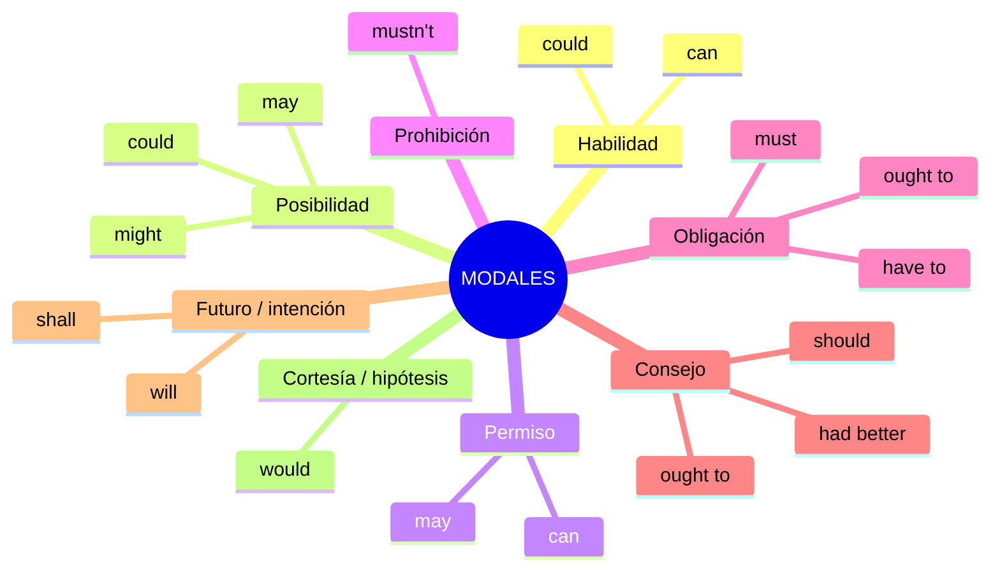
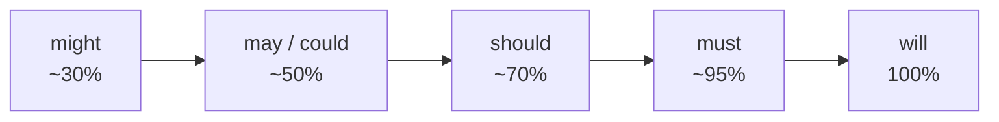

# B1 · Gramática 04 — Verbos Modales en Contexto

> 🎯 **Objetivo:** usar los modales según su *función comunicativa* (pedir permiso, dar consejo, expresar obligación...) y no solo memorizar su traducción.

Los modales (*can, could, may, might, must, shall, should, will, would, ought to*) son auxiliares que **matizan** el verbo principal. Reglas de oro que nunca cambian:

- No cambian con la persona: *he **can**, she **can*** (nunca *cans*).
- Van seguidos de **verbo base sin *to*** (excepción: *ought **to***).
- Para negar e interrogar, ellos mismos son el auxiliar (no usan *do*).

## Mapa por función

---

## 4.1 Capacidad y Habilidad — *can / could*

> *I **can** swim very well.* (presente)
> *When I was a child, I **could** run fast.* (habilidad pasada)
> ***Could** you help me with this?* (petición educada)

🔸 **Ampliación:** para habilidad futura o en tiempos donde *can* no existe, se usa *be able to*: *"I will **be able to** speak French soon."*

---

## 4.2 Posibilidad — *may / might / could*

> *It **may** rain tomorrow.* (posibilidad razonable ~50%)
> *She **might** be at home now.* (posibilidad menor ~30%)
> *That **could** be dangerous.* (posibilidad teórica)

**Escala de certeza:**

---

## 4.3 Permiso y Prohibición

| Modal | Función | Ejemplo |
|---|---|---|
| **can** | permiso informal | *Can I go to the bathroom?* |
| **may** | permiso formal | *May I ask you a question?* |
| **mustn't** | prohibición | *You mustn't smoke here.* |

🔸 **Ampliación — trampa clásica:** *mustn't* (prohibido) ≠ *don't have to* (no es necesario).
> *You **mustn't** park here.* = Está prohibido.
> *You **don't have to** park here.* = No es obligatorio (pero puedes).

---

## 4.4 Obligación y Necesidad — *must / have to / ought to*

> *You **must** wear a seatbelt.* (obligación fuerte, interna o legal)
> *I **have to** wake up early tomorrow.* (obligación externa/cotidiana)
> *You **ought to** apologize.* (deber moral)

🔑 **must vs have to:** *must* suele venir del hablante ("yo lo considero necesario"); *have to* viene de una regla externa ("las circunstancias lo imponen").

---

## 4.5 Consejo y Recomendación — *should / had better*

> *You **should** eat more vegetables.* (consejo normal)
> *You **had better** study, or you'll fail.* (consejo fuerte con advertencia)

🔸 **had better** /ˈhæd ˈbetər/ implica una **consecuencia negativa** si no se sigue. Es más urgente que *should*.

---

## 4.6 Intención y Futuro — *will / shall / would*

> *I **will** call you later.* (futuro/promesa)
> ***Shall** we go to the park?* (sugerencia formal)
> ***Would** you help me, please?* (petición muy educada)
> *If I were rich, I **would** travel the world.* (hipótesis)

---

## 4.7 Resumen funcional

| Modal | Funciones clave |
|---|---|
| **can / could** | habilidad, posibilidad, permiso |
| **may / might** | posibilidad, permiso formal |
| **must / have to** | obligación, necesidad |
| **should / ought to** | consejo, recomendación |
| **will / shall** | futuro, intención, sugerencia |
| **would** | condicionales, cortesía |

## 🏋️ Práctica

1. Permiso formal para salir temprano: "___ I leave early?"
2. Prohibición de usar el teléfono: "You ___ use your phone here."
3. Consejo fuerte con advertencia: "You ___ hurry, or you'll be late."
4. Deducción casi segura: "The lights are off. She ___ be asleep."

Ver respuestas

1. *May* 2. *mustn't* 3. *had better* 4. *must*

