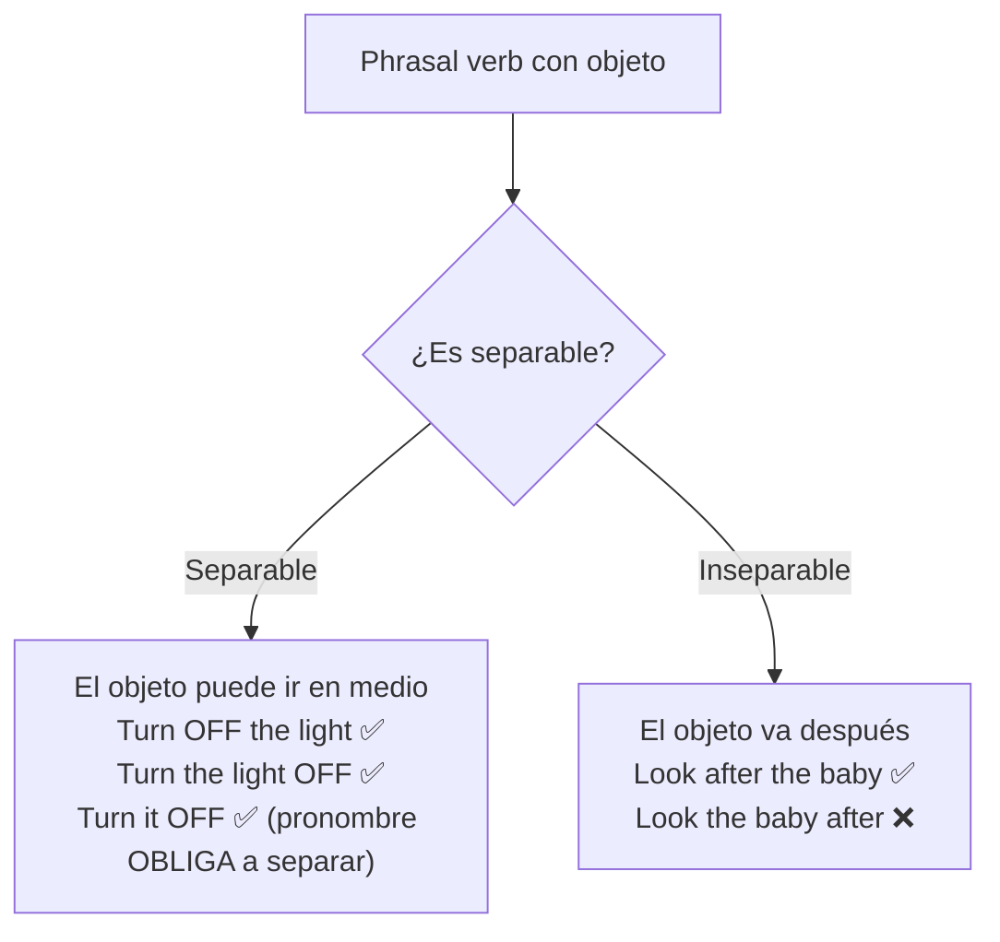

# B1 · Gramática 05 — Phrasal Verbs Comunes

> 🎯 **Objetivo:** entender la lógica de los phrasal verbs (no memorizarlos a ciegas) y dominar ~35 de los más frecuentes agrupados por tema.

Un **phrasal verb** = verbo + partícula (preposición o adverbio). Su significado suele ser **no literal**: *give up* no es "dar arriba", es "rendirse". Son el corazón del inglés hablado natural.

## ¿Cómo funcionan?

```mermaid
flowchart LR
    V["Verbo<br/>(look)"] + P["Partícula<br/>(up / after / for)"] --> M["Significado nuevo"]
    M --> M1["look up = buscar info"]
    M --> M2["look after = cuidar"]
    M --> M3["look for = buscar algo perdido"]
```

Una misma raíz cambia por completo según la partícula. Por eso se aprenden **en contexto**, no en lista suelta.

---

## 5.1 Acción Diaria

| Phrasal verb | Significado | Ejemplo |
|---|---|---|
| **wake up** | despertarse | *I wake up at 7 AM.* |
| **get up** | levantarse | *She gets up early.* |
| **put on** | ponerse (ropa) | *He put on his jacket.* |
| **take off** | quitarse (ropa) | *She took off her shoes.* |
| **go out** | salir | *We went out for dinner.* |
| **come back** | volver | *I'll come back in an hour.* |

---

## 5.2 Comunicación

| Phrasal verb | Significado | Ejemplo |
|---|---|---|
| **look up** | buscar información | *I looked up the word.* |
| **talk about** | hablar sobre | *We talked about the project.* |
| **bring up** | mencionar un tema | *She brought up a good point.* |
| **call back** | devolver la llamada | *I'll call you back.* |
| **hang up** | colgar el teléfono | *He hung up suddenly.* |

---

## 5.3 Trabajo y Estudio

| Phrasal verb | Significado | Ejemplo |
|---|---|---|
| **carry out** | llevar a cabo | *They carried out an experiment.* |
| **find out** | averiguar | *I need to find out the truth.* |
| **turn in** | entregar (tarea) | *I turned in my essay.* |
| **work on** | trabajar en algo | *She is working on a project.* |
| **look over** | revisar | *Please look over my report.* |

---

## 5.4 Relaciones y Emociones

| Phrasal verb | Significado | Ejemplo |
|---|---|---|
| **get along (with)** | llevarse bien | *I get along with my coworkers.* |
| **break up (with)** | terminar una relación | *They broke up last month.* |
| **cheer up** | animar(se) | *Cheer up! It'll be fine.* |
| **hang out (with)** | pasar el rato | *We hung out at the mall.* |

---

## 5.5 Movimiento y Dirección

| Phrasal verb | Significado | Ejemplo |
|---|---|---|
| **go back** | regresar | *We went back home.* |
| **run into** | encontrarse por casualidad | *I ran into an old friend.* |
| **set off** | partir (viaje) | *We set off early.* |
| **turn around** | dar la vuelta | *Turn around and look!* |

---

## 5.6 Problemas y Soluciones

| Phrasal verb | Significado | Ejemplo |
|---|---|---|
| **run out of** | quedarse sin | *We ran out of milk.* |
| **give up** | rendirse | *Don't give up!* |
| **sort out** | resolver | *We need to sort this out.* |
| **come up with** | idear/proponer | *She came up with a plan.* |

---

## 5.7 Separables vs Inseparables (ampliación clave)

Esto el libro no lo detalla, pero es fundamental:



🔑 **Regla del pronombre:** con phrasal verbs separables, si el objeto es un **pronombre** (*it, them, him*), **debe** ir en medio:
> ✅ *Turn **it** off.* ❌ *Turn off it.*

---

## 5.8 Consejos para aprenderlos

- 📌 Agrúpalos **por tema** (como aquí), no alfabéticamente.
- 📌 Úsalos en **frases propias** cada día.
- 📌 Asocia una **imagen mental** al significado.
- 📌 Anótalos cuando los oigas en series o canciones.

## 🏋️ Práctica

Reemplaza por un phrasal verb:
1. *We need to **investigate/discover** what happened.* → f___ o___
2. *Please **postpone** the meeting.* → p___ o___ (pista: no está arriba, es "put off")
3. *I **admire/respect** my teacher.* → l___ u___ t___ (pista: "look up to")

<details>
<summary>Ver respuestas</summary>

1. *find out* 2. *put off* 3. *look up to*
</details>
