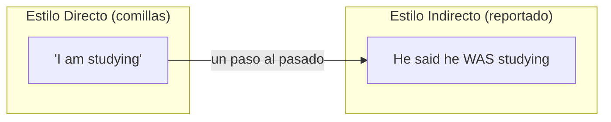
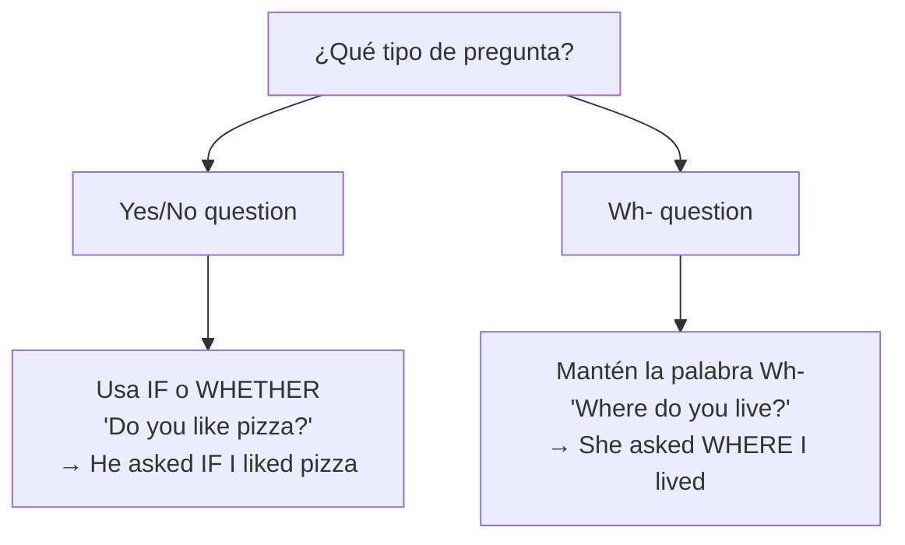

# B1 · Gramática 06 — Reported Speech (Estilo Indirecto)

> 🎯 **Objetivo:** reportar lo que otros dijeron sin citarlos textualmente, aplicando correctamente el "salto atrás" de los tiempos verbales (*backshift*).

El **estilo indirecto** convierte *"I am tired"* (directo) en *She said she **was** tired* (indirecto). La regla central: al reportar, los tiempos verbales **retroceden un paso hacia el pasado**.

## El concepto del "backshift"

---

## 6.1 Cambios en los Tiempos Verbales

| Estilo directo | → | Estilo indirecto |
|---|---|---|
| Presente simple (*like*) | → | Pasado simple (*liked*) |
| Presente continuo (*am studying*) | → | Pasado continuo (*was studying*) |
| Pasado simple (*saw*) | → | Pasado perfecto (*had seen*) |
| Presente perfecto (*have finished*) | → | Pasado perfecto (*had finished*) |
| Pasado continuo (*was reading*) | → | Pasado perfecto continuo (*had been reading*) |
| will | → | would |
| can | → | could |
| may | → | might |
| must | → | had to |

📌 **Ejemplos:**
> Directo: *"I like coffee."* → *She said (that) she **liked** coffee.*
> Directo: *"I have finished my work."* → *He said (that) he **had finished** his work.*
> Directo: *"I will call you tomorrow."* → *He said he **would** call me the next day.*

🔸 **Ampliación — cuándo NO hay backshift:** si reportas una **verdad universal** o algo que **sigue siendo cierto**, puedes mantener el presente: *"The Earth is round"* → *She said the Earth **is** round.*

---

## 6.2 Cambios en Expresiones de Tiempo y Lugar

| Directo | → | Indirecto |
|---|---|---|
| now | → | then |
| today | → | that day |
| yesterday | → | the day before |
| tomorrow | → | the next day / the following day |
| here | → | there |
| this | → | that |
| these | → | those |
| ago | → | before |
| last week | → | the week before |

📌 *"I saw her yesterday"* → *He said he had seen her **the day before**.*

---

## 6.3 Reportar Preguntas

Al reportar preguntas: se **elimina el signo de interrogación** y se usa el **orden normal** (sujeto + verbo, sin inversión ni auxiliar *do*).

📌 **Ejemplos:**
> *"Do you like pizza?"* → *He asked **if** I liked pizza.*
> *"Where do you live?"* → *She asked **where** I lived.*
> *"Why are you late?"* → *He asked **why** I was late.*

---

## 6.4 Reportar Órdenes y Sugerencias

Se usa *told* / *asked* + **infinitivo con *to***.

📌 **Órdenes:**
> *"Close the door!"* → *She **told** me **to close** the door.*
> *"Don't touch that!"* → *He told me **not to touch** that.*

📌 **Sugerencias:**
> *"You should see a doctor."* → *He suggested that I should see a doctor.*
> *"Let's study together."* → *She **suggested studying** together.* (suggest + -ing)

---

## 6.5 Verbos introductores (ampliación)

No todo es *said*. Enriquece tus reportes:

| Verbo | Uso | Ejemplo |
|---|---|---|
| **claim** | afirmar (dudoso) | *He claimed he was innocent.* |
| **admit** | admitir | *She admitted making a mistake.* |
| **deny** | negar | *He denied stealing the money.* |
| **promise** | prometer | *She promised to help.* |
| **warn** | advertir | *He warned me not to go.* |
| **explain** | explicar | *She explained that she was busy.* |

---

## ✅ Resumen

- Los tiempos **retroceden** un paso (backshift).
- Cambian las expresiones de **tiempo y lugar**.
- Preguntas → orden normal + *if/whether* o palabra *wh-*.
- Órdenes → *told/asked* + *to* + infinitivo.

## 🏋️ Práctica

Convierte a estilo indirecto:
1. *"I am hungry," she said.*
2. *"Where is the station?" he asked.*
3. *"Don't be late!" the teacher said.*
4. *"I have never been to Japan," he said.*

Ver respuestas

1. *She said (that) she was hungry.*
2. *He asked where the station was.*
3. *The teacher told us not to be late.*
4. *He said he had never been to Japan.*

