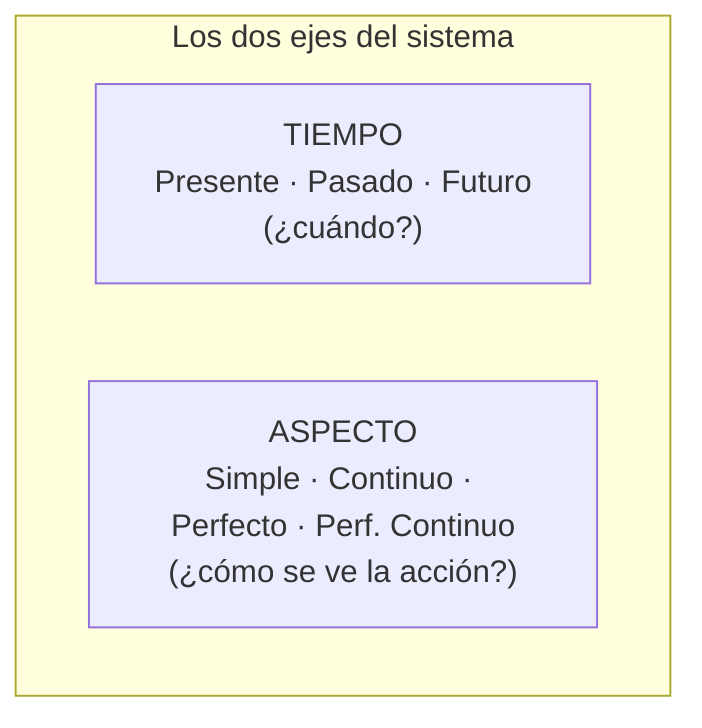
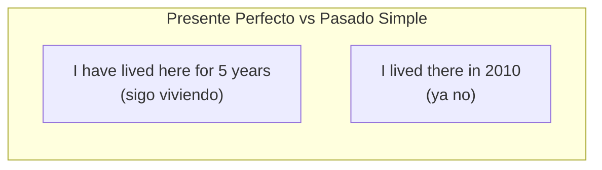

# B2 · Gramática 01 — Los 12 Tiempos Verbales Completos

> 🎯 **Objetivo:** dominar el sistema **completo** de 12 tiempos como una matriz lógica de 3×4, entendiendo qué añade cada "aspecto" (simple, continuo, perfecto, perfecto continuo) a cada "tiempo" (presente, pasado, futuro).

El inglés no tiene 12 tiempos aislados que memorizar: tiene **3 tiempos × 4 aspectos**. Si entiendes los dos ejes, deduces cualquier combinación.

## La matriz de los 12 tiempos

| | **SIMPLE** | **CONTINUO** | **PERFECTO** | **PERF. CONTINUO** |
|---|---|---|---|---|
| **PRESENTE** | I work | I am working | I have worked | I have been working |
| **PASADO** | I worked | I was working | I had worked | I had been working |
| **FUTURO** | I will work | I will be working | I will have worked | I will have been working |

**Qué añade cada aspecto:**
- **Simple** → el hecho, sin más (rutina, verdad).
- **Continuo** → acción *en progreso* (verbo + -ing).
- **Perfecto** → acción *conectada con otro momento* (have/had/will have + participio).
- **Perfecto continuo** → *duración* de una acción en progreso hasta un punto (have been + -ing).

---

## 🔵 PRESENTE

### 1.1 Presente Simple
📌 Hábitos, verdades generales, estados permanentes.
> *She works in a hospital.* — Afirm: *He speaks English.* / Neg: *He doesn't speak English.* / Preg: *Does he speak English?*

### 1.2 Presente Continuo
📌 Acción ahora mismo o plan futuro cercano.
> *She is studying now.* — *I am working.* / *I am not working.* / *Are you working?*

### 1.3 Presente Perfecto
📌 Experiencias sin tiempo específico, o pasado con relevancia presente.
> *I have visited Paris.* — *She has seen it.* / *She hasn't seen it.* / *Has she seen it?*

### 1.4 Presente Perfecto Continuo
📌 Acción que empezó en el pasado y **continúa**, con énfasis en la duración.
> *He has been working here for five years.* — *They have been studying.* / *...haven't been studying.* / *Have they been studying?*

---

## 🔴 PASADO

### 2.1 Pasado Simple
📌 Acción terminada en momento específico.
> *She went to the party yesterday.* — *He played.* / *He didn't play.* / *Did he play?*

### 2.2 Pasado Continuo
📌 Acción en progreso en un momento del pasado (a menudo interrumpida).
> *I was reading when you called.* — *She was studying.* / *...wasn't studying.* / *Was she studying?*

### 2.3 Pasado Perfecto
📌 Acción anterior a otra acción pasada ("el pasado del pasado").
> *He had finished before I arrived.* — *They had left.* / *...hadn't left.* / *Had they left?*

### 2.4 Pasado Perfecto Continuo
📌 Duración de una acción hasta un punto del pasado.
> *She had been working for three hours when we arrived.*

---

## 🟢 FUTURO

### 3.1 Futuro Simple
📌 Predicciones, promesas, decisiones espontáneas.
> *I will call you tomorrow.* — *She will travel.* / *...won't travel.* / *Will she travel?*

### 3.2 Futuro Continuo
📌 Acción en progreso en un momento futuro.
> *This time tomorrow, I will be flying to Spain.*

### 3.3 Futuro Perfecto
📌 Acción **terminada antes** de un punto futuro.
> *By 2030, I will have graduated.*

### 3.4 Futuro Perfecto Continuo
📌 Duración de una acción hasta un punto futuro.
> *By December, I will have been working here for five years.*

---

## 🔑 Líneas de tiempo comparadas

**El error #1 de hispanohablantes:** confundir *Presente Perfecto* con *Pasado Simple*.
- ✅ *I have visited Paris* (alguna vez, sin decir cuándo)
- ✅ *I visited Paris in 2019* (momento específico)
- ❌ *I have visited Paris in 2019* → INCORRECTO (no puedes dar fecha exacta con presente perfecto)

---

## 🏋️ Práctica

Identifica el tiempo y complétalo:
1. Acción en progreso ahora: *"Look! It ___ (rain)."*
2. Experiencia de vida: *"I ___ (never/be) to Asia."*
3. Pasado del pasado: *"When she arrived, the show ___ (already/start)."*
4. Terminado antes de un punto futuro: *"By midnight, they ___ (finish) the report."*

Ver respuestas

1. *is raining* (presente continuo)
2. *have never been* (presente perfecto)
3. *had already started* (pasado perfecto)
4. *will have finished* (futuro perfecto)

