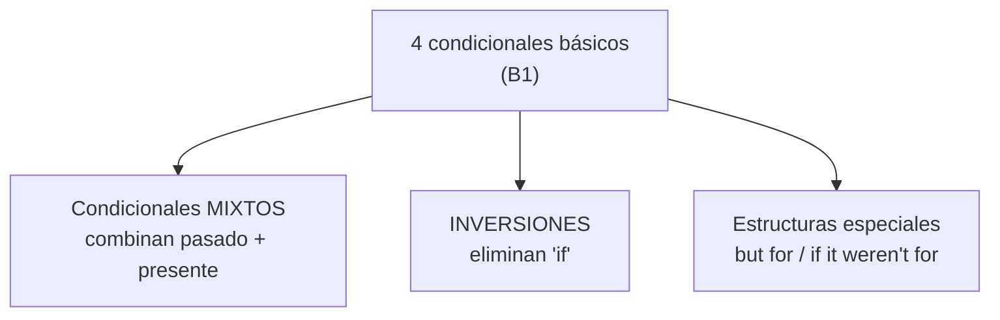
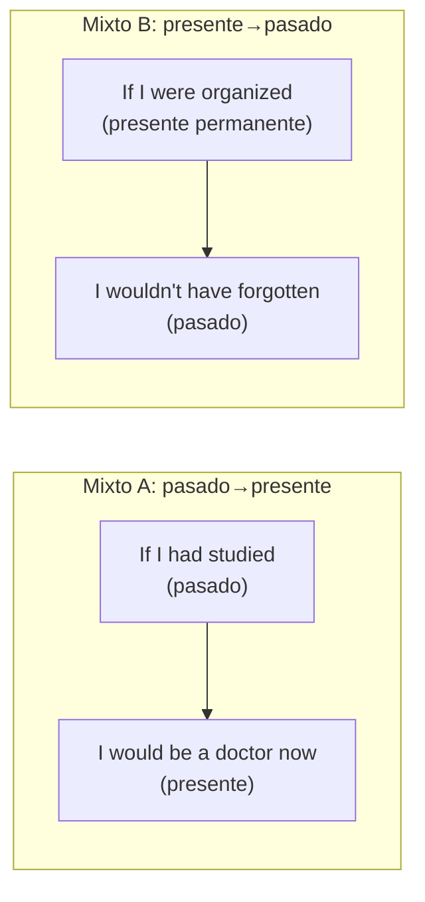
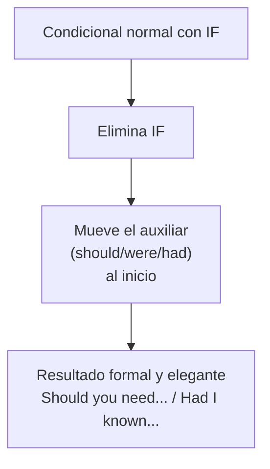

# B2 · Gramática 02 — Condicionales Avanzados

> 🎯 **Objetivo:** ir más allá de los 4 condicionales básicos hacia los **condicionales mixtos**, las **inversiones** sin *if* y estructuras sofisticadas (*but for, if it weren't for*) que marcan un nivel avanzado real.

Ya conoces Zero, First, Second y Third (repásalos en B1-G03). Aquí combinamos tiempos y aprendemos formas elegantes que usan los nativos cultos.

## Del básico al avanzado

---

## 2.1 Tercer Condicional (repaso profundo)

📌 **Uso:** situaciones pasadas hipotéticas que **no ocurrieron**.

📌 **Estructura:** `If + past perfect, would have + participio.`

> *If I had studied harder, I would have passed the exam.*

🔸 **Variaciones con otros modales:**
> *If I had trained more, I **could have** won the race.* (habría podido)
> *If she had asked, he **might have** said yes.* (quizás habría)

---

## 2.2 Condicionales Mixtos

Combinan tiempos de dos momentos distintos. Hay dos tipos:

### Tipo A — Pasado → Presente
📌 Un evento **pasado** afecta el **presente**.

📌 **Estructura:** `If + past perfect, would + infinitivo.`

> *If I had studied harder, I **would be** a doctor now.*
> (condición en pasado → resultado en presente)
> *If they had saved more money, they would be rich now.*

### Tipo B — Presente → Pasado
📌 Una **situación actual/permanente** afecta un evento **pasado**.

📌 **Estructura:** `If + past simple, would have + participio.`

> *If I **were** more organized, I **wouldn't have forgotten** the meeting.*
> (característica presente → consecuencia pasada)
> *If she weren't so shy, she would have spoken at the event.*

---

## 2.3 Estructuras Condicionales Especiales

### "But for" (Si no fuera por...)
📌 Enfatiza que una condición fue **crucial** para el resultado.
> ***But for** your help, I wouldn't have finished the project.*
> (Si no fuera por tu ayuda...)

### "If it weren't for / If it hadn't been for"
📌 Alternativa más común a *but for*.
> *If it **hadn't been for** the rain, we would have gone to the beach.* (pasado)
> *If it **weren't for** you, I'd be lost.* (presente)

---

## 2.4 Inversiones Condicionales (registro formal)

En inglés formal se **elimina *if*** invirtiendo el auxiliar. Suena sofisticado y culto.

| Con *if* | Inversión formal |
|---|---|
| If you should need help... | **Should** you need help... |
| If I were you... | **Were** I you... |
| If they had trained harder... | **Had** they trained harder... |

📌 **Ejemplos:**
> ***Should** you need anything, let me know.* (Si necesitaras algo...)
> ***Were** I in your position, I would accept.* (Si yo estuviera...)
> ***Had** they arrived earlier, they would have met the CEO.* (Si hubieran llegado...)

🔸 **Ampliación:** esta inversión es MUY común en cartas formales, contratos y discursos. *"Should you have any questions, please contact us"* es fórmula estándar de correos profesionales.

---

## ✅ Resumen

| Estructura | Ejemplo modelo |
|---|---|
| Tercer condicional | *If I had known, I would have come.* |
| Mixto pasado→presente | *If I had slept, I wouldn't be tired now.* |
| Mixto presente→pasado | *If I were rich, I would have bought it.* |
| But for | *But for you, I'd have failed.* |
| Inversión | *Had I known, I'd have helped.* |

## 🏋️ Práctica

1. Convierte a inversión: *"If you had told me earlier, I would have prepared."*
2. Forma un mixto pasado→presente: "Si hubiera aprendido a nadar (de niño), no tendría miedo (ahora)."
3. Usa *but for*: "Si no fuera por su consejo, habría cometido un error."

Ver respuestas

1. *Had you told me earlier, I would have prepared.*
2. *If I had learned to swim, I wouldn't be afraid now.*
3. *But for his advice, I would have made a mistake.*

