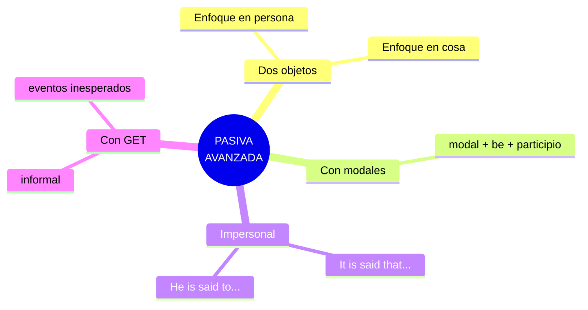
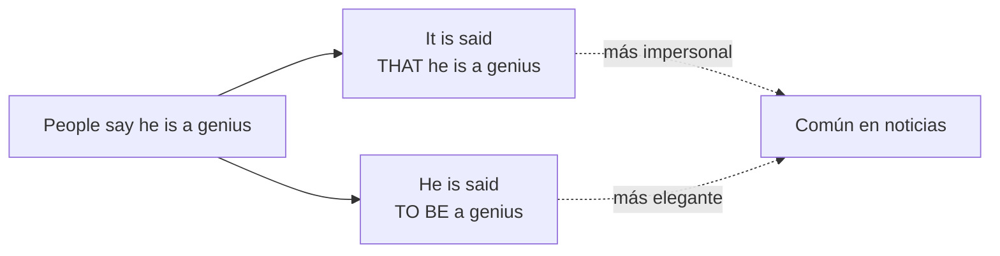

# B2 · Gramática 03 — Voz Pasiva Avanzada

> 🎯 **Objetivo:** dominar las construcciones pasivas complejas — dos objetos, modales, estructuras impersonales y la pasiva con *get* — que aparecen en inglés académico, periodístico y profesional.

Ya viste la pasiva básica (B1-G02). Aquí subimos a las cuatro estructuras avanzadas que distinguen a un hablante B2+.

## Las 4 pasivas avanzadas

---

## 3.1 Pasiva con Dos Objetos

Cuando un verbo tiene objeto directo **e** indirecto (*give, send, offer, tell, show*...), hay **dos** formas de pasivizar.

📌 **Activa:** *They gave María a prize.*

| Enfoque | Pasiva | Traducción |
|---|---|---|
| En la **persona** | *María was given a prize.* | A María le fue dado un premio |
| En la **cosa** | *A prize was given to María.* | Un premio fue dado a María |

🔑 **Nota:** en inglés formal, la primera opción (enfoque en la persona) es **más común y natural**.

---

## 3.2 Pasiva con Verbos Modales

📌 **Estructura:** `modal + be + participio pasado.`

> Activa: *They must complete the project by Friday.*
> Pasiva: *The project **must be completed** by Friday.*

📌 **Con modales perfectos:**
> Activa: *She should have finished the book.*
> Pasiva: *The book **should have been finished**.*

| Modal | Pasiva |
|---|---|
| can | *can be done* |
| must | *must be completed* |
| should | *should be sent* |
| might | *might be delayed* |
| could have | *could have been avoided* |
| should have | *should have been finished* |

---

## 3.3 Pasiva con Construcciones Impersonales

Cuando el sujeto es "la gente en general" o desconocido, se usan estructuras impersonales muy comunes en periodismo y ciencia.

📌 **Activa:** *People say that he is a genius.*

Dos formas de pasivizar:
> **Opción 1:** *It is said that he is a genius.* (Se dice que...)
> **Opción 2 (más formal):** *He is said to be a genius.*

**Otras construcciones frecuentes:**

| Estructura | Significado |
|---|---|
| It is **believed** that... | Se cree que... |
| It is **reported** that... | Se informa que... |
| It is **thought** that... | Se piensa que... |
| It is **known** that... | Se sabe que... |
| It is **claimed** that... | Se afirma que... |

🔸 **Ampliación — reportar el pasado:** para hechos anteriores, se usa *to have + participio*:
> *He is said **to have stolen** the money.* (Se dice que robó el dinero.)

---

## 3.4 Pasiva con "Get" (Get-Passive)

En contextos **informales** o para eventos **inesperados/negativos**, se sustituye *be* por *get*.

> *He **got fired** yesterday.* (Lo despidieron ayer.)

🔑 **Diferencia de matiz:**
| Forma | Registro | Connotación |
|---|---|---|
| *He **was** fired.* | formal, neutro | simple hecho |
| *He **got** fired.* | coloquial | sorpresa, mala suerte |

**Más ejemplos:**
> *She **got promoted** last week.* (La ascendieron.)
> *They **got arrested** for speeding.* (Los arrestaron.)
> *My phone **got stolen** on the bus.* (Me robaron el teléfono.)

🔸 **Ampliación:** el get-passive es tan común en inglés hablado que muchos libros lo ignoran, pero **lo oirás constantemente** en series y conversación real.

---

## ✅ Resumen

| Estructura | Ejemplo modelo |
|---|---|
| Dos objetos | *María was given a prize.* |
| Con modal | *It must be completed.* |
| Impersonal | *It is said that... / He is said to...* |
| Get-passive | *He got fired.* |

## 🏋️ Práctica

1. Pasiviza con enfoque en persona: *"They offered Ana a job."*
2. Pasiviza con modal: *"You must submit the form."*
3. Reescribe impersonal (2 formas): *"People believe she is honest."*
4. Cambia a get-passive: *"Someone stole his bike."*

Ver respuestas

1. *Ana was offered a job.*
2. *The form must be submitted.*
3. *It is believed that she is honest.* / *She is believed to be honest.*
4. *His bike got stolen.*

