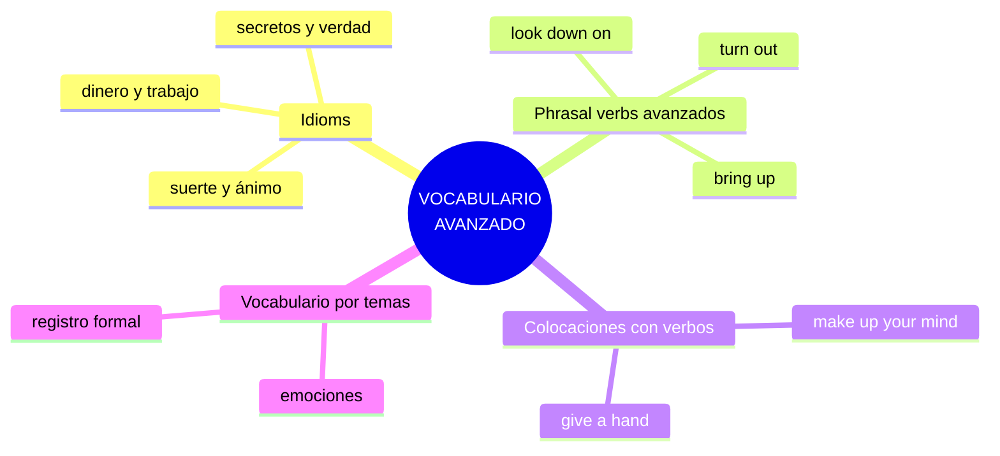

# B2 · Gramática 04 — Expresiones Idiomáticas y Vocabulario Avanzado

> 🎯 **Objetivo:** sonar natural, no como un libro de texto. Los idioms, phrasal verbs avanzados y vocabulario preciso son lo que separa a un hablante "correcto" de uno "fluido".

Las **expresiones idiomáticas** no se traducen literalmente: su significado es cultural. *Break a leg* no habla de piernas rotas — significa "¡buena suerte!". Aprenderlas en contexto es la clave.

## Mapa del vocabulario avanzado

---

## 4.1 Expresiones Idiomáticas Comunes

| Idiom | IPA (clave) | Significado |
|---|---|---|
| **Break a leg!** | /breɪk/ | ¡Mucha suerte! |
| **Spill the beans** | /spɪl/ | Revelar un secreto |
| **Hit the sack** | /sæk/ | Irse a dormir |
| **A blessing in disguise** | /dɪsˈɡaɪz/ | Algo bueno que parecía malo |
| **Once in a blue moon** | /blu mun/ | Muy rara vez |
| **Piece of cake** | /keɪk/ | Muy fácil |
| **Under the weather** | /ˈweðər/ | Sentirse mal/enfermo |
| **Cost an arm and a leg** | — | Costar carísimo |

📌 **En contexto:**
> *I only eat fast food **once in a blue moon**.* (muy de vez en cuando)
> *I felt **under the weather**, so I stayed home.* (me sentía mal)

---

## 4.2 Phrasal Verbs de Nivel Avanzado

| Phrasal verb | Significado | Ejemplo |
|---|---|---|
| **bring up** | mencionar un tema | *She brought up a sensitive issue.* |
| **look down on** | menospreciar | *Don't look down on others.* |
| **run out of** | quedarse sin | *We ran out of ideas.* |
| **put off** | posponer | *They put off the meeting.* |
| **turn out** | resultar ser | *It turned out to be a scam.* /skæm/ |
| **come across** | encontrar por casualidad | *I came across an old photo.* |
| **get away with** | salirse con la suya | *He got away with cheating.* |
| **look forward to** | esperar con ilusión | *I look forward to seeing you.* |

📌 *We **ran out of** milk, let's go to the store!*

---

## 4.3 Colocaciones con Verbos Comunes (collocations)

Las **collocations** son combinaciones fijas que suenan naturales. Un nativo dice *make a decision*, nunca *do a decision*.

| Colocación | Significado |
|---|---|
| **Take your time** | No te apresures |
| **Make up your mind** | Decídete |
| **Give someone a hand** | Ayudar a alguien |
| **Keep in touch** | Mantenerse en contacto |
| **Set the record straight** | Aclarar un malentendido |
| **Pay attention** | Prestar atención |
| **Make an effort** | Hacer un esfuerzo |
| **Take a risk** | Correr un riesgo |

📌 *Can you **give me a hand** with these boxes?*

🔸 **Ampliación — make vs do:** regla útil aunque con excepciones:
- **make** = crear/producir (*make a cake, make a decision, make progress*)
- **do** = realizar/actividad (*do homework, do the dishes, do exercise*)

---

## 4.4 Vocabulario Avanzado por Temas — Emociones

| Palabra | IPA | Significado |
|---|---|---|
| **Ecstatic** | /ɪkˈstætɪk/ | Eufórico |
| **Overwhelmed** | /ˌoʊvərˈwelmd/ | Abrumado |
| **Resilient** | /rɪˈzɪliənt/ | Resiliente, fuerte |
| **Apprehensive** | /ˌæprɪˈhensɪv/ | Ansioso, aprensivo |
| **Indifferent** | /ɪnˈdɪfərənt/ | Indiferente |
| **Content** | /kənˈtent/ | Satisfecho, a gusto |
| **Furious** | /ˈfjʊriəs/ | Furioso |
| **Anxious** | /ˈæŋkʃəs/ | Ansioso, inquieto |

📌 *She felt **ecstatic** after winning the competition!*

🔸 **Ampliación — escalar la intensidad:** en vez de repetir *happy/sad/angry*, sube de nivel:
- happy → glad → delighted → **ecstatic**
- sad → down → miserable → **devastated**
- angry → annoyed → furious → **livid** /ˈlɪvɪd/

---

## ✅ Consejos para dominarlo

- 📌 Aprende idioms **en frases completas**, nunca aislados.
- 📌 Agrupa por **tema** o por **verbo base**.
- 📌 Anota los que oigas en **series, podcasts y canciones**.
- 📌 Prioriza la **frecuencia**: mejor 20 idioms muy usados que 200 raros.

## 🏋️ Práctica

Reemplaza por un idiom/collocation:
1. *This exam was **very easy**.* → a p___ o___ c___
2. *I need to **decide**.* → m___ u___ m___ m___
3. *Let's **stay in contact**.* → k___ i___ t___
4. *She was **extremely happy**.* → e___

Ver respuestas

1. *a piece of cake* 2. *make up my mind* 3. *keep in touch* 4. *ecstatic*

