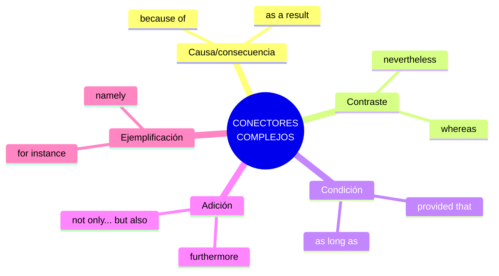
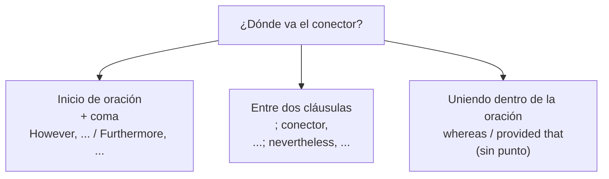

# B2 · Gramática 05 — Uso de Conectores Complejos

> 🎯 **Objetivo:** estructurar ideas con precisión usando conectores de nivel avanzado, entendiendo la puntuación y posición correcta de cada uno.

Los conectores (*linking words*) son el "pegamento" del discurso. En B2 ya no basta con *and, but, because*: necesitas *whereas, nevertheless, provided that, furthermore*... y saber **puntuarlos** bien.

## Clasificación por función

---

## 5.1 Causa y Consecuencia

| Conector | Significado | Ejemplo |
|---|---|---|
| **Because of** | Debido a | *We arrived late because of the traffic.* |
| **As a result** | Como resultado | *She didn't study. As a result, she failed.* |
| **Due to** | Debido a | *The delay was due to bad weather.* |
| **Consequently** | En consecuencia | *He lied; consequently, no one trusts him.* |

🔑 **Trampa clásica:** *because* + oración (sujeto+verbo) vs *because of* + sustantivo.
> ✅ *because **it rained*** / ✅ *because of **the rain***

---

## 5.2 Contraste

| Conector | Significado | Ejemplo |
|---|---|---|
| **Whereas** | Mientras que | *He loves coffee, whereas she prefers tea.* |
| **Nevertheless** | No obstante | *It was raining; nevertheless, they played outside.* |
| **However** | Sin embargo | *The plan is risky. However, it could work.* |
| **On the other hand** | Por otro lado | *It's expensive; on the other hand, it lasts longer.* |

🔸 **Ampliación — puntuación de *however*:** va seguido de coma y suele iniciar oración o ir entre punto y coma:
> *The hotel was small. **However,** it was comfortable.*
> *The hotel was small; **however,** it was comfortable.*

---

## 5.3 Condición

| Conector | Significado | Ejemplo |
|---|---|---|
| **Provided that** | Siempre que | *You can go, provided that you finish your homework.* |
| **As long as** | Mientras/siempre que | *You can borrow my car as long as you drive carefully.* |
| **Unless** | A menos que | *We'll go unless it rains.* |
| **In case** | Por si acaso | *Take an umbrella in case it rains.* |

---

## 5.4 Adición

| Conector | Significado | Ejemplo |
|---|---|---|
| **Furthermore** | Además | *The project is innovative. Furthermore, it's cost-effective.* |
| **Moreover** | Es más | *She is talented. Moreover, she works hard.* |
| **Not only... but also** | No solo... sino también | *She is not only intelligent but also hardworking.* |
| **In addition** | Además | *In addition, we offer free shipping.* |

🔸 **Ampliación — inversión con *not only*:** si empieza la oración, invierte el auxiliar (avance hacia C1):
> ***Not only did** she finish early, **but** she also helped others.*

---

## 5.5 Ejemplificación

| Conector | Significado | Ejemplo |
|---|---|---|
| **For instance** | Por ejemplo | *There are many benefits, for instance, better health.* |
| **Such as** | Tales como | *She enjoys activities such as hiking.* |
| **Namely** | A saber | *Three students were late, namely John, Sarah, and Mike.* |
| **In particular** | En particular | *I love fruit, in particular, mangoes.* |

---

## 5.6 Tabla de posición y puntuación

---

## ✅ Resumen

| Función | Conectores clave |
|---|---|
| Causa/consec. | because of, as a result, consequently |
| Contraste | whereas, nevertheless, however |
| Condición | provided that, as long as, unless |
| Adición | furthermore, moreover, not only... but also |
| Ejemplos | for instance, such as, namely |

## 🏋️ Práctica

Elige el conector correcto:
1. *"He is rich; ___, he is not happy."* (contraste)
2. *"You can stay ___ you are quiet."* (condición)
3. *"We canceled the trip ___ the storm."* (causa + sustantivo)
4. *"She speaks French. ___, she speaks German."* (adición)

Ver respuestas

1. *however / nevertheless* 2. *provided that / as long as* 3. *because of / due to* 4. *Furthermore / Moreover*

