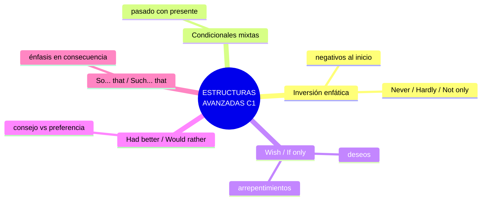
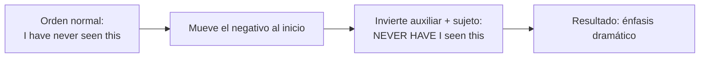
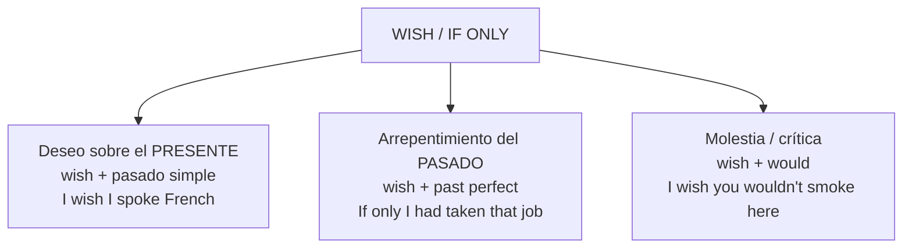
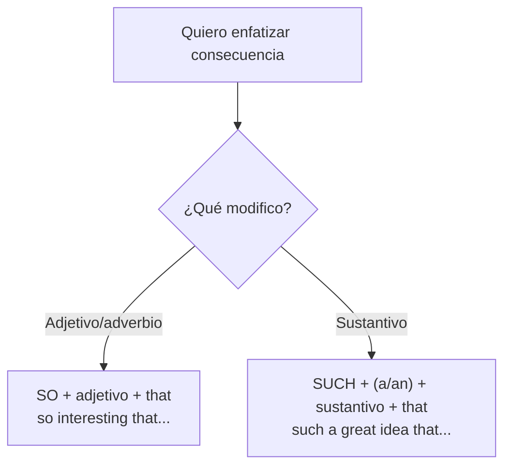

# C1 · Gramática 01 — Estructuras Gramaticales Avanzadas

> 🎯 **Objetivo:** manejar recursos sintácticos que usan los hablantes nativos cultos para dar énfasis, elegancia y precisión — inversiones, condicionales mixtas, *wish/if only*, y estructuras enfáticas. Este es el terreno donde el inglés deja de ser "correcto" para volverse **sofisticado**.

En C1 la gramática ya no busca solo comunicar, sino **cómo** comunicar: con matices, énfasis y estilo literario. Estas estructuras aparecen en literatura, discursos, ensayos académicos y periodismo de calidad.

## Panorama de la unidad

---

## 1.1 Inversión para Énfasis

Normalmente el orden es Sujeto + Verbo. Pero cuando una oración empieza con una **palabra negativa o restrictiva**, se **invierte** el auxiliar antes del sujeto (como en una pregunta). Da un tono dramático y formal.

📌 **Regla:** Palabra negativa/restrictiva + **auxiliar + sujeto** + verbo.

| Expresión inicial | Ejemplo |
|---|---|
| **Never** | *Never have I seen such a breathtaking view.* /ˈbreθteɪkɪŋ/ |
| **Not only** | *Not only did she finish the project, but she also presented it perfectly.* |
| **Hardly... when** | *Hardly had I arrived when the phone rang.* |
| **Little** | *Little did they know what awaited them.* |
| **No sooner... than** | *No sooner had we left than it started to rain.* |
| **Rarely / Seldom** | *Rarely do we see such talent.* |
| **Under no circumstances** | *Under no circumstances should you open this door.* |

🔸 **Ampliación:** esta estructura es un sello del inglés literario y de discursos. *"Never have I been so proud"* suena infinitamente más potente que *"I have never been so proud"*.

---

## 1.2 Estructuras Condicionales Mixtas

Combinan tiempos de distintos momentos (repaso profundo de B2-G02, ahora con matices).

> *If she **had studied** more, she **would be** a doctor now.*
> (pasado hipotético → consecuencia presente)
> *If I **were** taller, I **could have become** a basketball player.*
> (característica presente → consecuencia pasada)

🔑 **Clave:** se combinan tiempos pasados y presentes para expresar situaciones irreales en **momentos diferentes** de forma simultánea.

---

## 1.3 Estructuras con "Wish" y "If only"

Expresan deseos y arrepentimientos. La estructura verbal cambia según el momento del deseo.

| Tipo | Estructura | Ejemplo | Significado |
|---|---|---|---|
| Deseo presente | wish + pasado simple | *I wish I spoke French.* | Ojalá hablara francés (pero no) |
| Arrepentimiento | wish/if only + past perfect | *If only I had taken that job.* | Ojalá lo hubiera aceptado |
| Molestia | wish + would | *I wish you wouldn't smoke here.* | Ojalá no fumaras aquí |

🔑 **Regla de oro:** *wish + past simple* = presente; *wish + past perfect* = pasado.

🔸 **Ampliación — "were" tras wish:** con *to be*, se usa *were* para todas las personas: *I wish I **were** taller.*

---

## 1.4 "Had better" vs "Would rather"

Ambas son estructuras avanzadas, pero con funciones distintas:

| Estructura | Función | Ejemplo |
|---|---|---|
| **Had better** (+ base) | consejo con tono de **advertencia** | *You had better study for the exam.* |
| **Would rather** (+ base) | **preferencia** personal | *I would rather stay home than go out.* |

🔸 **Ampliación — would rather con dos sujetos:** cuando prefieres que *otro* haga algo, usa pasado: *"I would rather you **didn't** smoke."* (Preferiría que no fumaras.)

---

## 1.5 "So... that" y "Such... that"

Ambas enfatizan una **consecuencia**, pero la estructura cambia:

> *The book was **so interesting that** I read it in one day.*
> *It was **such a beautiful day that** we went to the beach.*

🔸 **Ampliación — con sustantivos incontables/plurales:** *such* sin artículo: *"They were **such kind people that** everyone loved them."*

---

## ✅ Resumen

| Estructura | Función | Ejemplo modelo |
|---|---|---|
| Inversión | énfasis dramático | *Never have I seen...* |
| Condicional mixta | irrealidad en 2 tiempos | *If I had slept, I'd be fine now.* |
| Wish / if only | deseo / arrepentimiento | *I wish I knew.* |
| Had better | consejo-advertencia | *You'd better hurry.* |
| Would rather | preferencia | *I'd rather stay.* |
| So/such... that | consecuencia enfática | *So good that...* / *Such a day that...* |

## 🏋️ Práctica

1. Reescribe con inversión: *"I have never eaten such delicious food."*
2. Completa (wish): *"I ___ (can) fly."* (deseo presente)
3. Completa (wish): *"If only I ___ (study) harder."* (arrepentimiento)
4. So o such: *"It was ___ an amazing concert that we cried."*

Ver respuestas

1. *Never have I eaten such delicious food.*
2. *I wish I could fly.*
3. *If only I had studied harder.*
4. *such*

