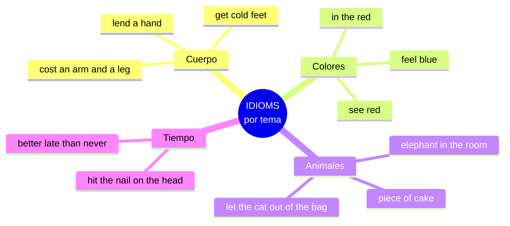
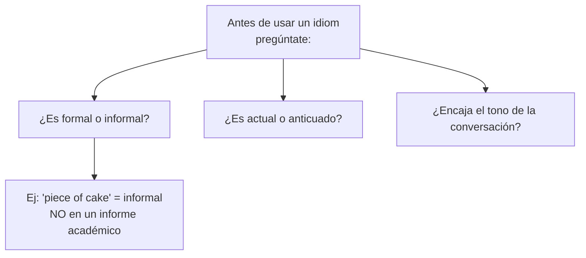

# C1 · Gramática 02 — Modismos y Expresiones Idiomáticas

> 🎯 **Objetivo:** construir un repertorio de idioms organizados por campo semántico (cuerpo, colores, animales, tiempo) para comprender y producir inglés natural, coloquial y con color cultural.

Los **modismos** son la última frontera de la fluidez. Un C1 no solo los entiende, los **usa con naturalidad** y percibe su registro (formal, humorístico, anticuado). Aquí van organizados por temas para memorizarlos por asociación.

## Mapa temático de idioms

---

## 2.1 Expresiones con Partes del Cuerpo

| Idiom | IPA (clave) | Significado |
|---|---|---|
| **Break a leg!** | /leɡ/ | ¡Mucha suerte! |
| **Cost an arm and a leg** | /ɑːrm/ | Costar un ojo de la cara |
| **Get cold feet** | /fiːt/ | Echarse atrás por nervios |
| **Lend a hand** | /lend/ | Echar una mano |
| **Pull someone's leg** | /pʊl/ | Tomar el pelo |
| **Keep an eye on** | /aɪ/ | Vigilar |
| **Off the top of my head** | — | Sin pensarlo mucho |

📌 *I was going to sing at the event, but I **got cold feet** and canceled.*

---

## 2.2 Expresiones con Colores

| Idiom | Significado |
|---|---|
| **Feel blue** | Estar triste |
| **See red** | Ponerse furioso |
| **Once in a blue moon** | Muy rara vez |
| **Be in the red** | Estar en números rojos (deudas) |
| **Be in the black** | Tener ganancias |
| **A grey area** | Zona ambigua |
| **Green with envy** | Muerto de envidia |
| **Catch someone red-handed** | Atrapar con las manos en la masa |

📌 *She's been **feeling blue** since she moved to another city.*

🔸 **Ampliación cultural:** *in the red / in the black* viene de la contabilidad antigua: las pérdidas se anotaban con tinta roja, las ganancias con negra.

---

## 2.3 Expresiones con Animales

| Idiom | Significado |
|---|---|
| **A piece of cake** | Pan comido (muy fácil) |
| **Kill two birds with one stone** | Matar dos pájaros de un tiro |
| **The elephant in the room** | El tema incómodo que nadie menciona |
| **Let the cat out of the bag** | Revelar un secreto |
| **Hold your horses** | Espera, cálmate |
| **When pigs fly** | Cuando las ranas críen pelo (nunca) |
| **The lion's share** | La mayor parte |
| **A dark horse** | Alguien con talento oculto |

📌 *I finished the exam in 10 minutes! It was **a piece of cake**.*

---

## 2.4 Expresiones con Tiempo

| Idiom | Significado |
|---|---|
| **Better late than never** | Más vale tarde que nunca |
| **In the blink of an eye** | En un abrir y cerrar de ojos |
| **Call it a day** | Dar por terminado el día |
| **Hit the nail on the head** | Dar en el clavo |
| **Beat around the bush** | Andarse con rodeos |
| **Once in a lifetime** | Único en la vida |
| **Against the clock** | Contrarreloj |

📌 *You **hit the nail on the head** with your analysis of the situation!*

---

## 2.5 Registro: cuándo usar cada idiom (ampliación C1)

🔑 **Consejo C1:** los idioms brillan en conversación y escritura creativa, pero **evítalos en textos académicos formales**, donde suenan fuera de lugar. Saber *cuándo no usarlos* es tan importante como conocerlos.

---

## ✅ Estrategia de aprendizaje

- 📌 Memoriza por **campo semántico** (como aquí).
- 📌 Aprende el **registro** de cada uno.
- 📌 Exponte a inglés real: series, standup comedy, podcasts.
- 📌 Usa 2-3 nuevos por semana en conversación.

## 🏋️ Práctica

Traduce usando un idiom:
1. "Ese examen fue muy fácil."
2. "No te andes con rodeos."
3. "Reveló el secreto sin querer."
4. "Diste en el clavo."

Ver respuestas

1. *That exam was a piece of cake.*
2. *Don't beat around the bush.*
3. *He let the cat out of the bag.*
4. *You hit the nail on the head.*

