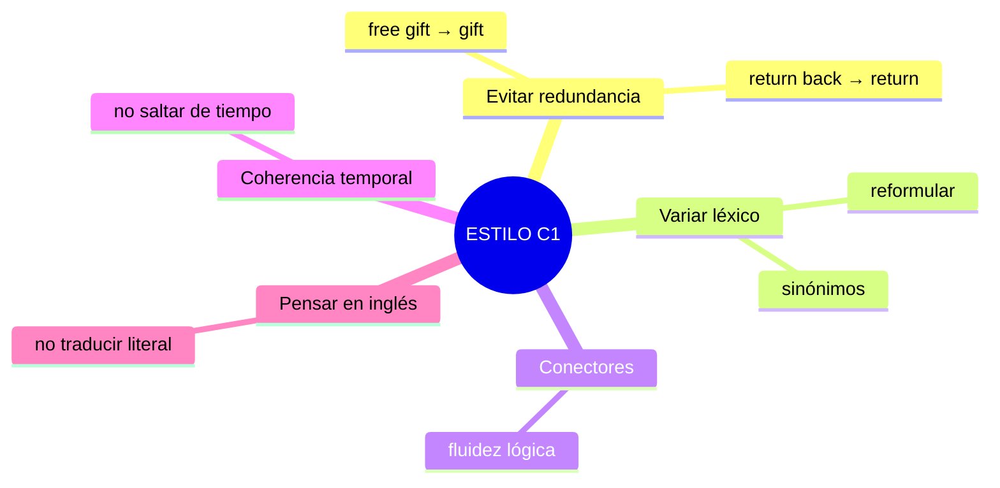
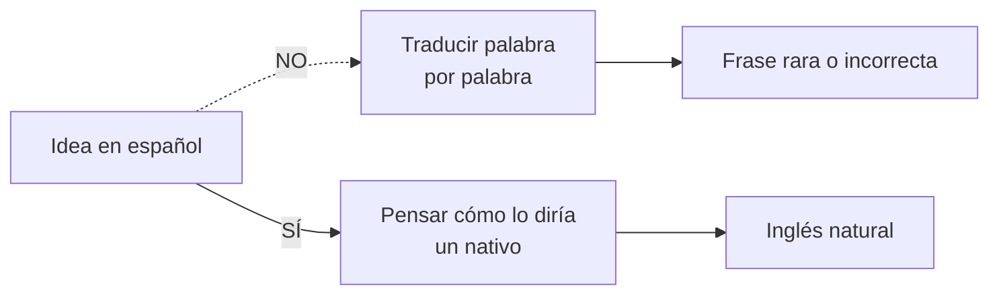

# C1 · Gramática 03 — Perfeccionamiento del Estilo y Coherencia

> 🎯 **Objetivo:** escribir y hablar con claridad, precisión y elegancia — evitando redundancias, variando el léxico, manteniendo la coherencia temporal y pensando en inglés (no traduciendo).

En C1 la gramática correcta ya se da por sentada. Lo que distingue a un usuario avanzado es el **estilo**: cómo evita la repetición, cómo estructura, cómo suena natural. Esta unidad es sobre *pulir*.

## Los 5 pilares del buen estilo

---

## 3.1 Evita la Redundancia

Palabras innecesarias hacen el discurso confuso o pesado. El inglés valora la **economía**.

| ❌ Redundante | ✅ Corregido |
|---|---|
| She returned **back** to her house | She returned to her house |
| **Free** gift | Gift |
| **End** result | Result |
| **Past** history | History |
| **Advance** planning | Planning |
| **Repeat** again | Repeat |
| Each and **every** | Each / Every |

🔸 **Ampliación — pleonasmos comunes:** *"ATM machine"* (la M ya es "machine"), *"PIN number"* (la N ya es "number") son redundancias que hasta los nativos cometen; en escritura culta se evitan.

---

## 3.2 Usa Sinónimos y Evita Repeticiones

Repetir la misma palabra vuelve el texto monótono. Compara:

> ❌ *The movie was **interesting**. The story was also **interesting**, and the characters were **interesting** too.*

> ✅ *The movie was **fascinating**. The plot was **engaging**, and the characters were **captivating**.*

**Banco de sinónimos útil:**

| Palabra básica | Alternativas C1 |
|---|---|
| good | excellent, outstanding, remarkable |
| bad | poor, dreadful, appalling |
| big | enormous, vast, substantial |
| interesting | fascinating, compelling, intriguing |
| important | crucial, vital, significant |
| happy | delighted, thrilled, content |

---

## 3.3 Usa Conectores para la Fluidez

Ya vistos en B2-G05 y ampliados en C1-G05. Un texto sin conectores suena entrecortado.

> ❌ *I love reading. It helps my vocabulary. It improves my writing.*
> ✅ *I love reading. **Furthermore**, it helps improve my vocabulary **and**, **as a result**, my writing skills.*

---

## 3.4 Mantén la Coherencia en los Tiempos Verbales

Saltar de un tiempo a otro sin razón confunde al lector.

> ❌ *Yesterday I **go** to the store and **bought** some fruit.*
> ✅ *Yesterday I **went** to the store and **bought** some fruit.*

🔑 Si narras en pasado, **quédate** en pasado (salvo que haya una razón lógica para cambiar, como un comentario en presente sobre una verdad general).

---

## 3.5 Piensa en Inglés — Evita Traducciones Literales

Traducir palabra por palabra del español produce frases sin sentido.

| ❌ Traducción literal | ✅ Inglés natural | Español |
|---|---|---|
| *I have 20 years* | *I am 20 years old* | Tengo 20 años |
| *Make a question* | *Ask a question* | Hacer una pregunta |
| *I am agree* | *I agree* | Estoy de acuerdo |
| *Since two years* | *For two years* | Desde hace dos años |
| *Assist to a meeting* | *Attend a meeting* | Asistir a una reunión |

🔸 **Ampliación — falsos amigos frecuentes:** *actually* = en realidad (no "actualmente" = *currently*); *assist* = ayudar (no "asistir" = *attend*); *realize* = darse cuenta (no "realizar" = *carry out*); *sensible* = sensato (no "sensible" = *sensitive*).

---

## ✅ Checklist de estilo C1

Antes de dar por terminado un texto, revisa:
- [ ] ¿Eliminé palabras redundantes?
- [ ] ¿Varié el vocabulario en lugar de repetir?
- [ ] ¿Usé conectores para unir ideas?
- [ ] ¿Mantuve coherencia en los tiempos verbales?
- [ ] ¿Suena natural o parece traducido?

## 🏋️ Práctica

Corrige el error de estilo:
1. *"He returned back home."*
2. *"I have 25 years."*
3. *"Yesterday she goes to the party and danced."*
4. *"The book was interesting and the plot was interesting."*

Ver respuestas

1. *He returned home.* (quita "back")
2. *I am 25 years old.*
3. *Yesterday she went to the party and danced.*
4. *The book was fascinating and the plot was engaging.*

