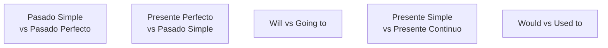
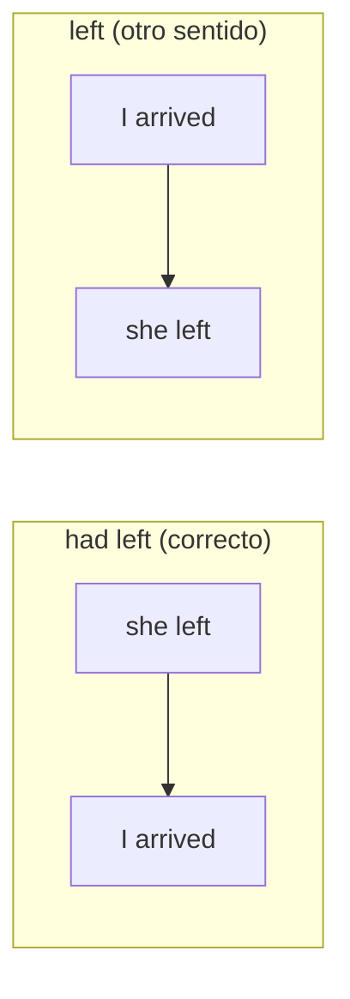
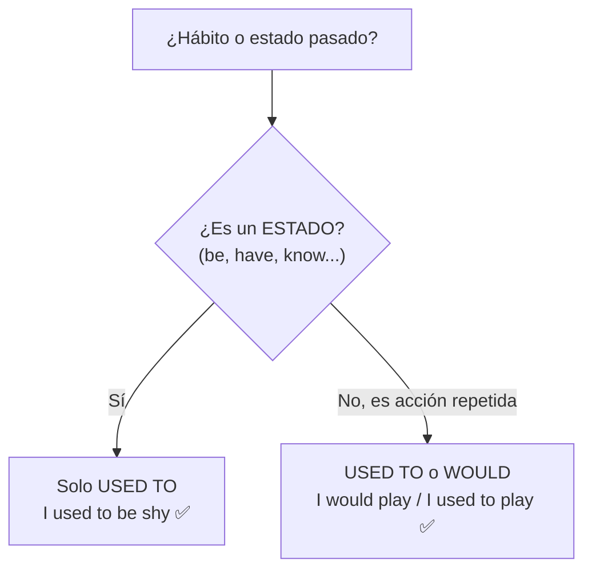

# C1 · Gramática 04 — Matices en los Tiempos Verbales

> 🎯 **Objetivo:** dominar las distinciones finas entre tiempos que parecen intercambiables pero comunican matices distintos — donde se juegan los errores más "invisibles" de los hispanohablantes avanzados.

En C1 ya conoces todos los tiempos. El reto ahora es **elegir con precisión** entre dos opciones gramaticalmente posibles pero con **significados distintos**. Estos matices son el detalle que delata (o corona) la fluidez.

## Los duelos de tiempos

---

## 4.1 Pasado Simple vs Pasado Perfecto

- **Pasado Simple** → acción terminada en un momento específico.
  > *I met Sarah yesterday.*
- **Pasado Perfecto** → acción **anterior** a otra acción pasada.
  > *When I arrived, she **had already left**.*

❌ **Error común:** *When I arrived, she left.*
Esto implica que ambas ocurrieron **al mismo tiempo** (ella se fue justo cuando llegaste), lo cual cambia el sentido si en realidad ella se fue **antes**.

---

## 4.2 Presente Perfecto vs Pasado Simple

- **Presente Perfecto** → experiencias, acciones recientes o con relevancia actual, **sin momento específico**.
  > *I **have visited** Paris twice.* / *She **has just finished** her homework.*
- **Pasado Simple** → cuando se menciona un **momento concreto**.
  > *I **visited** Paris in 2019.*

❌ **Error común:** *I have visited Paris in 2019.*
Incorrecto: "2019" es un momento específico → exige pasado simple.

🔑 **Regla mnemotécnica:** ¿hay una fecha/momento exacto? → **pasado simple**. ¿Es una experiencia general o reciente sin fecha? → **presente perfecto**.

---

## 4.3 Will vs Going to (matices finos)

- **Will** → decisiones espontáneas, promesas, predicciones **sin evidencia**.
  > *I think it **will** rain tomorrow.* / *I **will** call you later.*
- **Going to** → intención previa o predicción **con evidencia**.
  > *Look at those clouds! It's **going to** rain.* / *I'm **going to** study medicine.*

❌ **Error común:** *I think I am going to pass the exam.*
En una predicción sin evidencia, mejor *"I think I **will** pass"*.

---

## 4.4 Presente Simple vs Presente Continuo

- **Presente Simple** → hábitos, verdades generales, estados permanentes.
  > *She **works** as a teacher.* / *Water **boils** at 100°C.*
- **Presente Continuo** → acciones en progreso o planes futuros.
  > *She **is working** on a new project.* / *We **are traveling** next week.*

❌ **Error común:** *I am knowing the answer.*
Incorrecto: *know* es un **verbo de estado** (stative verb) y no se usa en continuo.

🔸 **Ampliación — verbos de estado (stative verbs):** no suelen ir en continuo:
- **Percepción mental:** know, believe, understand, remember, think (=opinar)
- **Emoción:** love, hate, like, want, prefer
- **Posesión:** have (=poseer), own, belong
- **Sentidos:** see, hear, smell, taste

⚠️ Algunos cambian de significado: *"I **think** it's good"* (opinión, estado) vs *"I'm **thinking** about it"* (proceso mental activo). *"I **have** a car"* (poseer) vs *"I'm **having** lunch"* (acción).

---

## 4.5 Would vs Used to (hábitos pasados)

- **Used to** → hábitos **y estados** pasados que ya no ocurren.
  > *I **used to** play soccer.* / *I **used to** be shy.* ✅ (estado)
- **Would** → hábitos pasados repetidos, **pero NO estados**.
  > *When I was a child, I **would** play soccer every weekend.* ✅
  > *I **would** be shy as a child.* ❌ → debe ser *I used to be shy.*

---

## ✅ Tabla de matices

| Duelo | Elige A cuando... | Elige B cuando... |
|---|---|---|
| Past Simple / Past Perfect | momento único | acción anterior a otra pasada |
| Present Perfect / Past Simple | sin fecha, relevancia actual | con fecha específica |
| Will / Going to | espontáneo, sin evidencia | plan previo, con evidencia |
| Present Simple / Continuous | hábito, estado | en progreso, plan |
| Would / Used to | (would) acción repetida | (used to) también estados |

## 🏋️ Práctica

Elige la forma correcta:
1. *"By the time we arrived, the movie ___ (start)."*
2. *"I ___ (see) that film last night."* (vs "I have seen")
3. *"I ___ (be) very shy when I was young."* (would/used to)
4. *"Quiet! I ___ (think) about the answer."* (think/am thinking)

Ver respuestas

1. *had started* (pasado perfecto)
2. *saw* (momento específico: last night)
3. *used to be* (estado → no "would")
4. *am thinking* (proceso activo)

