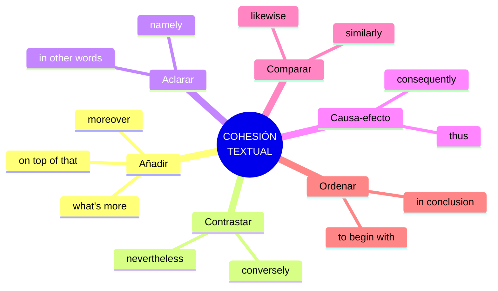
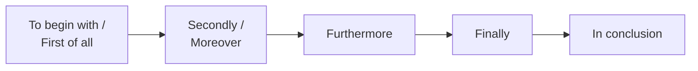

# C1 · Gramática 05 — Conectores Avanzados y Cohesión Textual

> 🎯 **Objetivo:** lograr un discurso con **cohesión textual** de nivel nativo culto — encadenando ideas con conectores sofisticados clasificados por función, para escritura académica, ensayos y presentaciones profesionales.

La **cohesión** es lo que hace que un texto "fluya" en lugar de sonar como una lista de frases sueltas. En C1 se espera un uso preciso y variado de conectores, sin repetir siempre los mismos.

## Las 6 familias de conectores C1

---

## 5.1 Conectores para Añadir Información

| Conector | Significado |
|---|---|
| **Moreover** | Además, es más |
| **Furthermore** | Además, asimismo |
| **Not only that, but…** | No solo eso, sino que… |
| **What's more** | Lo que es más |
| **On top of that** | Encima de eso |
| **In addition (to)** | Además (de) |

📌 *She is intelligent. **Moreover**, she is hardworking.*

---

## 5.2 Conectores para Contrastar Ideas

| Conector | Significado |
|---|---|
| **However** | Sin embargo |
| **Nevertheless** | No obstante |
| **On the other hand** | Por otro lado |
| **Conversely** | A la inversa |
| **Whereas** | Mientras que |
| **In contrast** | En contraste |

📌 *I like tea. **However**, my sister prefers coffee.*

🔸 **Matiz C1:** *conversely* introduce lo **opuesto exacto**; *however* solo señala contraste general. Elegir bien demuestra precisión.

---

## 5.3 Conectores para Explicar o Aclarar

| Conector | Significado |
|---|---|
| **In other words** | En otras palabras |
| **That is to say** | Es decir |
| **Namely** | A saber |
| **For instance** | Por ejemplo |
| **To illustrate** | Para ilustrar |
| **To put it simply** | Dicho de forma simple |

📌 *He is an introvert. **In other words**, he prefers being alone to being in big groups.*

---

## 5.4 Conectores de Causa y Efecto

| Conector | Significado |
|---|---|
| **Therefore** | Por lo tanto |
| **Thus** | Así, por lo tanto (formal) |
| **As a result** | Como resultado |
| **Consequently** | En consecuencia |
| **Due to** | Debido a |
| **Hence** | De ahí que (muy formal) |

📌 *She didn't study. **As a result**, she failed the exam.*

🔸 **Registro:** *thus* y *hence* son de registro alto (ensayos, artículos); *so* es el equivalente coloquial.

---

## 5.5 Conectores para Comparar

| Conector | Significado |
|---|---|
| **Similarly** | De manera similar |
| **Likewise** | Del mismo modo |
| **In the same way** | De la misma manera |
| **Just as / Just like** | Tal como |
| **Compared to/with** | En comparación con |

📌 *Dogs are loyal. **Similarly**, cats can be very affectionate.*

---

## 5.6 Conectores para Ordenar Ideas

Estructuran un texto de principio a fin:

| Conector | Función |
|---|---|
| **First of all / To begin with** | Introducir el primer punto |
| **Secondly / Then** | Segundo punto |
| **Furthermore / Moreover** | Añadir |
| **Finally / Lastly** | Último punto |
| **In conclusion / To sum up** | Cerrar |

📌 ***First of all**, we need to analyze the data. **Secondly**, we will create a report. **Finally**, we will present our findings.*

---

## 5.7 Cohesión más allá de los conectores (ampliación C1)

La cohesión no es solo conectores. También se logra con:

- **Referencia pronominal:** usar *it, this, that, they* para no repetir. *"The plan failed. **This** surprised everyone."*
- **Sustitución:** *"I need a pen. Do you have **one**?"*
- **Elipsis:** omitir lo repetido. *"She can sing and (she can) dance."*
- **Palabras de encapsulado:** *this issue, such an approach, that argument* — resumen ideas previas.

🔑 Un texto C1 combina conectores + estos recursos para fluir sin repetición ni saltos.

---

## ✅ Resumen

| Función | Conectores C1 |
|---|---|
| Añadir | moreover, what's more, on top of that |
| Contrastar | conversely, nevertheless, on the other hand |
| Aclarar | in other words, namely, to illustrate |
| Causa-efecto | thus, consequently, hence |
| Comparar | likewise, similarly, compared to |
| Ordenar | to begin with, finally, in conclusion |

## 🏋️ Práctica

Elige el conector más preciso:
1. *"He's tall; ___, his brother is short."* (opuesto exacto)
2. *"The project was over budget. ___, it was late."* (añadir, informal-alto)
3. *"The data is incomplete. ___, we cannot conclude yet."* (causa-efecto formal)
4. *"To begin with... Secondly... ___."* (cierre)

Ver respuestas

1. *conversely* 2. *What's more / On top of that* 3. *Thus / Therefore / Consequently* 4. *In conclusion / Finally*

