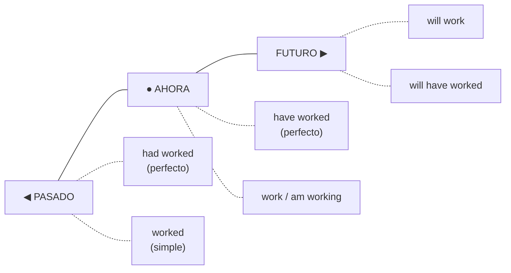
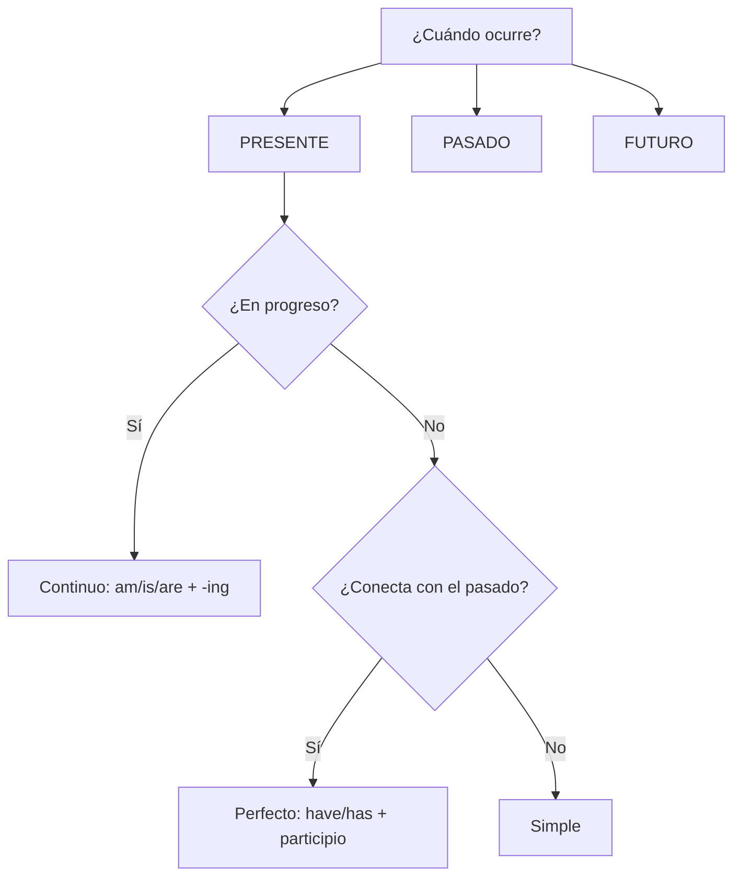

# EXTRA · Anexo 01 — Resumen de los Tiempos Verbales

> 📋 **Referencia rápida** de los tiempos verbales principales, con uso, estructura y ejemplo. Ideal para consulta veloz o repaso antes de un examen.

## Tabla maestra de los 12 tiempos

| Tiempo | Estructura | Uso principal | Ejemplo |
|---|---|---|---|
| **Presente Simple** | S + verbo | hábitos, verdades | *She works every day.* |
| **Presente Continuo** | S + am/is/are + -ing | ahora, planes | *I am studying now.* |
| **Presente Perfecto** | S + have/has + participio | experiencia, relevancia | *They have visited Paris.* |
| **Pres. Perfecto Continuo** | S + have/has been + -ing | duración hasta ahora | *I have been working for hours.* |
| **Pasado Simple** | S + verbo pasado | acción terminada | *She visited her grandmother yesterday.* |
| **Pasado Continuo** | S + was/were + -ing | en progreso en el pasado | *I was sleeping when he called.* |
| **Pasado Perfecto** | S + had + participio | antes de otra acción pasada | *She had already left when I arrived.* |
| **Pas. Perfecto Continuo** | S + had been + -ing | duración hasta un punto pasado | *He had been waiting for an hour.* |
| **Futuro Simple** | S + will + verbo | predicción, promesa | *I will help you.* |
| **Futuro con Going to** | S + am/is/are going to + verbo | plan, evidencia | *They are going to move to Spain.* |
| **Futuro Perfecto** | S + will have + participio | terminado antes de un punto futuro | *By 2025, I will have graduated.* |
| **Fut. Perfecto Continuo** | S + will have been + -ing | duración hasta un punto futuro | *I will have been working for 5 years.* |

## Línea de tiempo visual

## Guía rápida de decisión

📌 💡 **Consejo:** practicar con frases reales ayuda a recordar mejor cada tiempo verbal. No memorices tablas — construye oraciones sobre tu propia vida.
