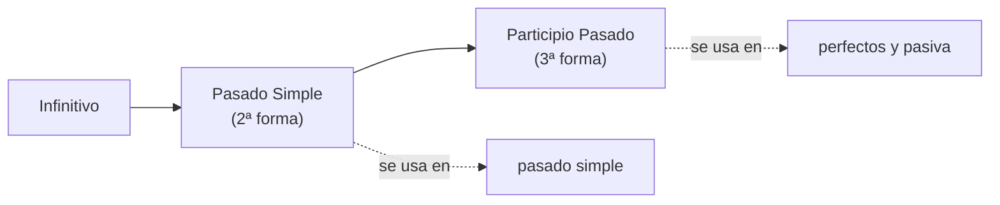
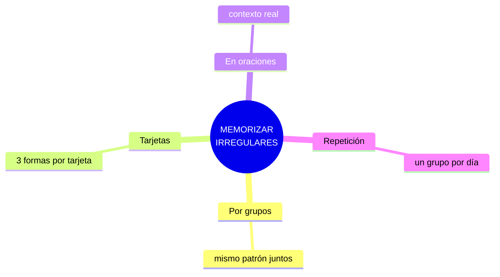

# EXTRA · Anexo 02 — Lista Completa de Verbos Irregulares

> 📋 Los verbos irregulares no siguen la regla de añadir *-ed*. Aquí están **agrupados por patrón de conjugación** para que memorizarlos sea más fácil: aprender por similitud es mucho más eficiente que en orden alfabético.

## Cómo usar esta lista

Cada verbo tiene 3 formas: **base – pasado – participio**. Ejemplo: *go – went – gone*.

---

## 🔹 Grupo 1 — Las tres formas son iguales

| Base | Pasado | Participio | Significado |
|---|---|---|---|
| bet | bet | bet | apostar |
| cost | cost | cost | costar |
| cut | cut | cut | cortar |
| hit | hit | hit | golpear |
| hurt | hurt | hurt | herir, dañar |
| let | let | let | permitir, dejar |
| put | put | put | poner |
| read | read | read | leer — *IPA: /riːd/ – /rɛd/ – /rɛd/* (¡se escribe igual pero cambia el sonido!) |
| set | set | set | colocar, ajustar |
| shut | shut | shut | cerrar |

---

## 🔹 Grupo 2 — Pasado y participio iguales

| Base | Pasado | Participio | Significado |
|---|---|---|---|
| bend | bent | bent | doblar |
| bring | brought | brought | traer |
| build | built | built | construir |
| buy | bought | bought | comprar |
| catch | caught | caught | atrapar |
| feel | felt | felt | sentir |
| find | found | found | encontrar |
| get | got | got | obtener |
| have | had | had | tener |
| hear | heard | heard | oír |
| keep | kept | kept | mantener |
| leave | left | left | dejar, salir |
| lose | lost | lost | perder |
| make | made | made | hacer |
| meet | met | met | conocer, reunirse |
| say | said | said | decir |
| sell | sold | sold | vender |
| send | sent | sent | enviar |
| sit | sat | sat | sentarse |
| sleep | slept | slept | dormir |
| stand | stood | stood | ponerse de pie |
| teach | taught | taught | enseñar |
| tell | told | told | contar, decir |
| think | thought | thought | pensar |
| understand | understood | understood | entender |
| win | won | won | ganar |

---

## 🔹 Grupo 3 — Las tres formas son diferentes

| Base | Pasado | Participio | Significado |
|---|---|---|---|
| begin | began | begun | empezar |
| drink | drank | drunk | beber |
| drive | drove | driven | conducir |
| eat | ate | eaten | comer |
| fall | fell | fallen | caer |
| fly | flew | flown | volar |
| forget | forgot | forgotten | olvidar |
| give | gave | given | dar |
| go | went | gone | ir |
| know | knew | known | saber, conocer |
| see | saw | seen | ver |
| take | took | taken | tomar |
| wear | wore | worn | usar, llevar puesto |
| write | wrote | written | escribir |

---

## 🔹 Grupo 4 — Cambio de vocal + participio en "-en"

| Base | Pasado | Participio | Significado |
|---|---|---|---|
| break | broke | broken | romper |
| choose | chose | chosen | elegir |
| speak | spoke | spoken | hablar |
| steal | stole | stolen | robar |
| wake | woke | woken | despertar |

---

## 🔹 Grupo 5 — Participio en "-n" o "-ne"

| Base | Pasado | Participio | Significado |
|---|---|---|---|
| blow | blew | blown | soplar |
| grow | grew | grown | crecer |
| hide | hid | hidden | esconder |
| ride | rode | ridden | montar |
| ring | rang | rung | sonar, timbrar |
| sing | sang | sung | cantar |
| sink | sank | sunk | hundir |
| swim | swam | swum | nadar |

---

## 🔹 Grupo 6 — Alternancias muy irregulares

| Base | Pasado | Participio | Significado |
|---|---|---|---|
| be | was/were | been | ser/estar |
| do | did | done | hacer |
| have | had | had | tener |
| say | said | said | decir |

---

## 📌 Tips para memorizarlos

- ✅ Organízalos en **grupos similares** (como esta tabla).
- ✅ Usa **tarjetas de memoria** (flashcards) con las tres formas.
- ✅ Practica con **oraciones reales**, no listas sueltas.
- ✅ Aprende **un grupo por día** en vez de todos de golpe.

🚀 ¡Aprender los verbos irregulares es clave para hablar inglés con fluidez!
