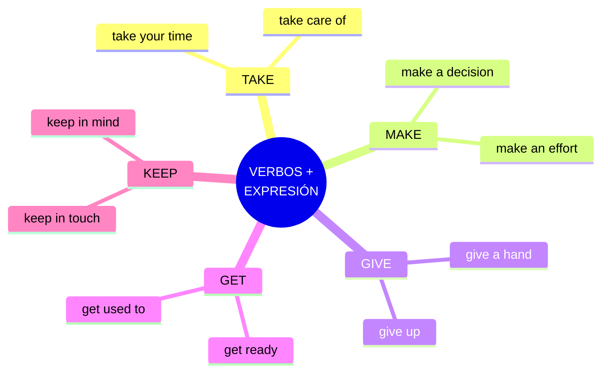

# EXTRA · Anexo 03 — Expresiones Comunes con Verbos

> 📋 Los verbos más frecuentes del inglés (*take, make, give, get, keep*) forman **colocaciones** fijas que aparecen constantemente. Aprenderlas como bloques te da fluidez inmediata.

## Mapa de los 5 verbos clave

---

## 3.1 Expresiones con "Take" (tomar, llevar)

| Expresión | Significado |
|---|---|
| **Take your time** | Tómate tu tiempo |
| **Take a break** | Tomarse un descanso |
| **Take into account** | Tomar en cuenta |
| **Take care of** | Cuidar de |
| **Take advantage of** | Aprovechar |
| **Take place** | Tener lugar, ocurrir |
| **Take part in** | Participar en |

📌 *You should **take into account** the weather before traveling.*

---

## 3.2 Expresiones con "Make" (hacer, causar)

| Expresión | Significado |
|---|---|
| **Make a decision** | Tomar una decisión |
| **Make progress** | Hacer progreso |
| **Make a mistake** | Cometer un error |
| **Make a difference** | Marcar la diferencia |
| **Make an effort** | Hacer un esfuerzo |
| **Make sense** | Tener sentido |
| **Make up your mind** | Decidirse |

📌 *She **made an effort** to finish the project on time.*

🔸 **Recordatorio make vs do:** *make* = crear/producir algo nuevo; *do* = realizar una actividad o tarea.

---

## 3.3 Expresiones con "Give" (dar, ofrecer)

| Expresión | Significado |
|---|---|
| **Give someone a hand** | Echar una mano |
| **Give it a try** | Intentarlo |
| **Give up** | Rendirse |
| **Give birth** | Dar a luz |
| **Give someone a call** | Llamar a alguien |
| **Give a speech** | Dar un discurso |

📌 *I can't open this jar, can you **give me a hand**?*

---

## 3.4 Expresiones con "Get" (obtener, llegar a ser)

| Expresión | Significado |
|---|---|
| **Get ready** | Prepararse |
| **Get lost** | Perderse |
| **Get along with** | Llevarse bien con |
| **Get used to** | Acostumbrarse a |
| **Get in trouble** | Meterse en problemas |
| **Get rid of** | Deshacerse de |
| **Get in touch** | Ponerse en contacto |

📌 *It took me a while to **get used to** waking up early.*

---

## 3.5 Expresiones con "Keep" (mantener, seguir)

| Expresión | Significado |
|---|---|
| **Keep in touch** | Mantenerse en contacto |
| **Keep an eye on** | Vigilar |
| **Keep going** | Seguir adelante |
| **Keep calm** | Mantener la calma |
| **Keep in mind** | Tener en cuenta |
| **Keep a secret** | Guardar un secreto |
| **Keep a promise** | Cumplir una promesa |

📌 ***Keep in mind** that learning a language takes time.*

---

🚀 💡 **Consejo:** aprende estas expresiones **en frases**, no aisladas, y úsalas en conversación para que se vuelvan automáticas. ¡Practica con ellas todos los días!
