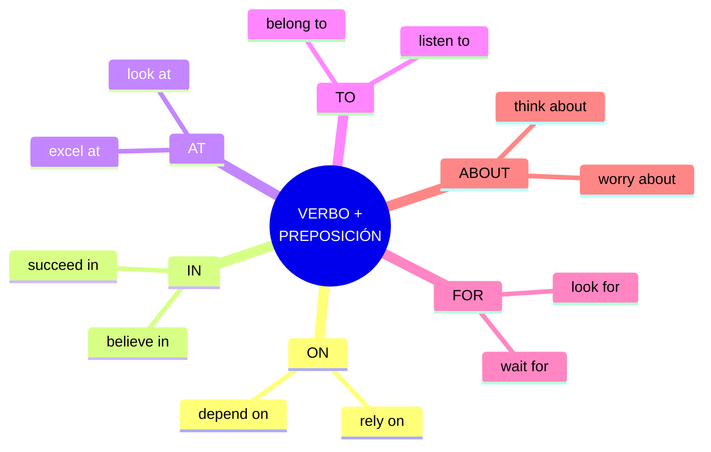

# EXTRA · Anexo 04 — Verbos con Preposiciones

> 📋 Muchos verbos ingleses van **casados con una preposición fija** (*depend **on**, believe **in**, listen **to***). Usar la preposición equivocada es uno de los errores más comunes. Aquí están organizados por preposición.

## Mapa por preposición

🔑 **Advertencia:** la preposición NO se traduce literalmente del español. *"Depender **de**"* → *depend **on*** (no *"depend of"*). Hay que memorizar la pareja completa.

---

## 4.1 Verbos con "On"

| Verbo | Significado | Ejemplo |
|---|---|---|
| **depend on** | depender de | *It depends on you.* |
| **focus on** | centrarse en | *Focus on your goals.* |
| **insist on** | insistir en | *She insisted on paying.* |
| **rely on** | confiar en | *You can rely on me.* |
| **work on** | trabajar en | *I'm working on a project.* |

📌 *You can always **rely on** me if you need help.*

---

## 4.2 Verbos con "In"

| Verbo | Significado | Ejemplo |
|---|---|---|
| **believe in** | creer en | *I believe in you.* |
| **participate in** | participar en | *She participated in the contest.* |
| **succeed in** | tener éxito en | *He succeeded in his career.* |
| **engage in** | involucrarse en | *They engaged in a debate.* |
| **specialize in** | especializarse en | *She specializes in architecture.* |

📌 *She **specializes in** modern architecture.*

---

## 4.3 Verbos con "At"

| Verbo | Significado | Ejemplo |
|---|---|---|
| **look at** | mirar a | *Look at the board.* |
| **laugh at** | reírse de | *Don't laugh at him.* |
| **aim at** | apuntar a | *We aim at excellence.* |
| **arrive at** | llegar a (lugar específico) | *We arrived at the airport.* |
| **excel at** | destacar en | *He excels at chess.* |

📌 *He **excels at** playing the piano.*

🔸 **Ampliación — arrive at vs in:** *arrive **at*** un lugar puntual (estación, aeropuerto); *arrive **in*** una ciudad o país (*arrive in London*).

---

## 4.4 Verbos con "To"

| Verbo | Significado | Ejemplo |
|---|---|---|
| **listen to** | escuchar a | *Listen to me.* |
| **talk to** | hablar con | *I talked to her.* |
| **belong to** | pertenecer a | *This book belongs to me.* |
| **react to** | reaccionar a | *How did he react to the news?* |
| **apologize to** | pedir disculpas a | *I apologized to her.* |

📌 *I **apologized to** her for being late.*

---

## 4.5 Verbos con "For"

| Verbo | Significado | Ejemplo |
|---|---|---|
| **wait for** | esperar a | *I'm waiting for the bus.* |
| **look for** | buscar | *I'm looking for my keys.* |
| **pay for** | pagar por | *He paid for dinner.* |
| **ask for** | pedir | *She asked for help.* |
| **blame for** | culpar por | *Don't blame me for that.* |

📌 *I am **looking for** a new job.*

---

## 4.6 Verbos con "About"

| Verbo | Significado | Ejemplo |
|---|---|---|
| **think about** | pensar en | *I'm thinking about it.* |
| **worry about** | preocuparse por | *Don't worry about it.* |
| **dream about** | soñar con | *I dreamed about you.* |
| **complain about** | quejarse de | *He complained about the noise.* |
| **forget about** | olvidarse de | *Forget about the past.* |

📌 *Stop **worrying about** the exam, you'll do great!*

---

## ✅ Tabla resumen por preposición

| Preposición | Verbos clave |
|---|---|
| **on** | depend, focus, insist, rely, work |
| **in** | believe, participate, succeed, engage, specialize |
| **at** | look, laugh, aim, arrive, excel |
| **to** | listen, talk, belong, react, apologize |
| **for** | wait, look, pay, ask, blame |
| **about** | think, worry, dream, complain, forget |

🚀 💡 **Consejo:** practica estos verbos con preposiciones en **frases completas** para recordarlos mejor. La preposición se pega al verbo con la repetición, no con la memorización aislada.

---

## 🎯 ¡Felicidades!

Has completado el recorrido completo por la gramática inglesa, desde las bases fundamentales (A1) hasta las estructuras avanzadas (C1) y los anexos de referencia.

El aprendizaje no termina aquí: la clave para mejorar es la **práctica constante**. Sigue construyendo oraciones, exponte a inglés real (series, podcasts, lectura) y usa lo aprendido cada día.

🚀 **Sigue practicando, sigue aprendiendo y sigue avanzando. ¡El inglés ya es parte de ti!** 💪
